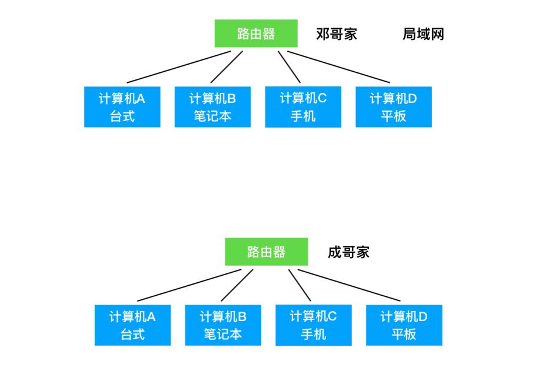
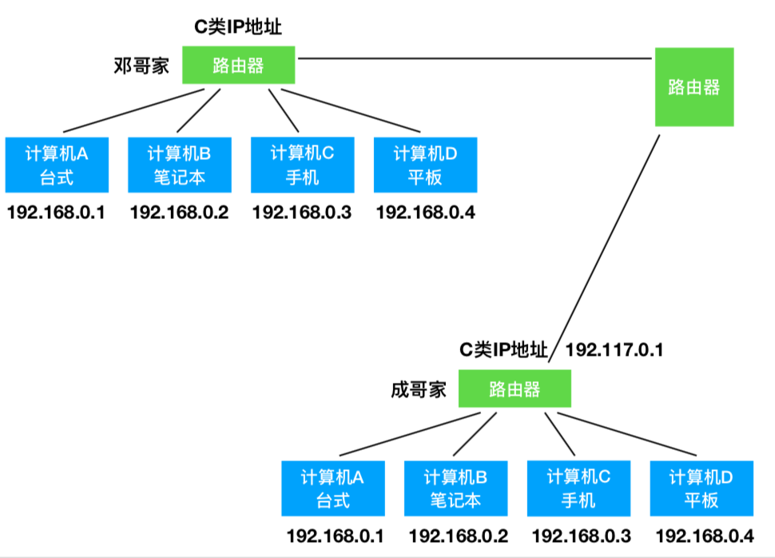
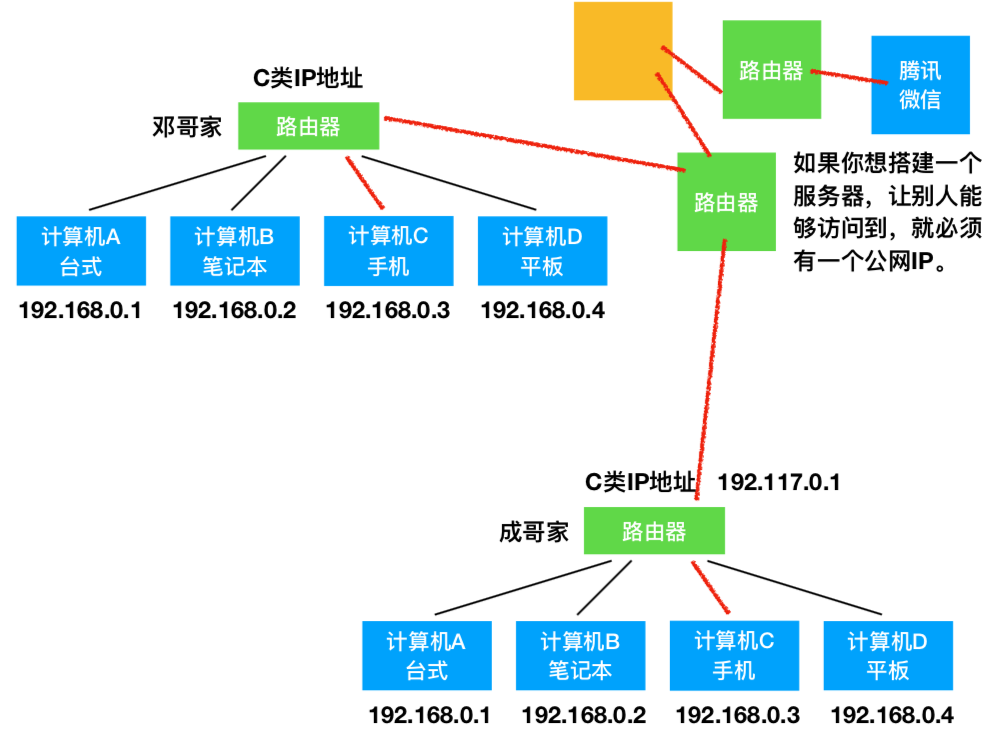
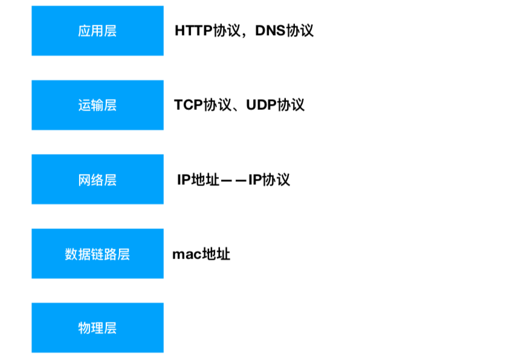
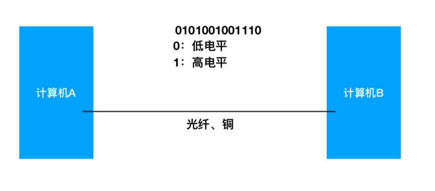
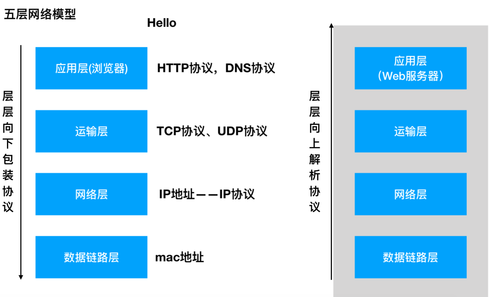

# 基础

# 局域网

## 局域网内

局域网内的机器可以互相连通，跨局域网的机器不能互相连通。

##  IP 地址

**IP 地址的格式:**

IP 地址分为四个段:xxx.xxx.xxx.xxx，每个段 0~255，每个段，都是由 8 个 0、1 组成的。

**IP 地址的分类:**

⼀一个 IP 地址分为两个部分:⽹网络 ID，主机 ID

A 类:0.0.0.0 ~ 127.255.255.255(⼀一个⽹网络能有 1600+万台)

B 类:128.0.0.0 ~ 191.255.255.255(172.16.0.0 ~ 172.31.255.255)

C 类:192.0.0.0 ~ 223.255.255.255(192.168.xxx.xxx)

D 类:(多播地址)

E 类:

## 两个局域网连通

## 公网访问

# 域名

**能通过域名直接访问到一台机器吗?**

> 不可以的。

**用域名和 IP 形成对应关系：**

> 首先，计算机是不知道域名对应的 IP 的。
> 问路由器，如果路由器认识这个域名，就返回一个 IP，然后计算机访问这个 IP。 如果路由器不认识，他就问上一层路路由器。

> 如果问到了城市这个级别的路由器的时候，一般有一台 DNS 服务器，如果 DNS 服务器不认识这个域名，继续向上级 DNS 服务器查找。

> 互联网建立的时候，13 台总的 DNS 服务器。

**当向浏览器的地址栏中输入一个 url 按回⻋之后，网络中都会发生什么?**

> 1. 看浏览器的缓存。
> 2. 看本机 host，IP 映射。C:windows/system32/drivers/etc/host 127.0.0.1 localhost
>    0.0.0.0 不知道 IP，默认打到自己本机上，所以用 0.0.0.0 也能访问到本机。(不缓存）
> 3. 家里路由器有没有缓存这个映射
> 4. 上级路由、城市的 LDNS 服务器 继续向上级的 DNS 服务器找。
> 5. gDNS 服务器。

# 网络模型

## 五层⽹络模型

**硬件层面：**

- 物理层**：**定义传输的介质。传输的频率
- 数据链路层：mac 地址

**网络层：**

IP 地址--IP 协议。

**应用层：**

软件定义的协议。

**两台计算机发送数据：**

**发送 hello 的过程：**

> TCP/IP 协议(对⽅的 IP，⾃己的 IP，对方的端口) HTTP 协议 (请求头) hello 。

## 4.2 HTTP 协议

> 是一种明文传输协议。

- Request

> **包含：**请求头、数据体
>
> **格式：**
>
> `请求方式 路径 协议版本`
>
> `GET /path?a=1&b=1 HTTP1.1` 不带域名，请求的参数都在 url 里
>
> `POST /path?a=1&b=2 HTTP1.1`
>
> **请求方式：**GET/POST——HEAD,PUT,DELETE

- Response

> **包含：**响应头、数据体
>
> **格式：**
>
> `协议版本 状态码 message `
>
> `属性:值`
>
> `属性:值`
>
> `属性:值`

### Get 与 Post 请求⽅式的区别

**是基于什么前提的?**

1. 如果什么前提都没有

不使用任何规范，只考虑语法和理论上的 HTTP 协议。GET 和 POST 几乎没有什么区别，只有名字不一样。

1. 如果是基于 RFC 规范的

- 理论上的(Specification):

> GET 和 POST 具有相同语法的，但是有不同的语义。
>
> get 是用来获取数据的，post 是用来发送数据的，其他⽅方面没有区别。

- 实现上的(Implementation):

> 各种浏览器，就是这个规范的实现者。
>
> **常见的那些不同:**
>
> 1. GET 的数据在 URL 是可见的。POST 请求不显示在 URL 中。
>
> 2. GET 对⻓度是有限制的，POST ⻓长度是⽆限的。
>
> 3. GET 请求的数据可以收藏为书签，post 请求到的数据不可收藏为书签。
>
> 4. GET 请求后，按后退按钮、刷新按钮无影响，post 数据会被重新提交。
>
> 5. GET 编码类型:` application/x-www-form-url`，
>
> post 的编码类型:有很多种。
> `encodeapplication/x-www-form-urlencoded` > `multipart/form-data `
>
> 6. GET 历史参数会被保留留在浏览器里，psot 不会保存在浏览器中的。
> 7. GET 只允许 ASCII，post 没有编码限制，允许发二进制的。
>
> 8. GET 与 POST 相⽐，GET 安全性较差，因为所发的数据是 URL 的⼀一部分。

# 基础

# 1 Cookie与Session

## 1.1 Cookie 

**Cookie:**

> 前端⻚⾯上，可以持久化存储数据的东⻄。
>
> Cookie是有限制的。
>
> Cookie是存在浏览器⾥的，不是存在某个⻚⾯上的。是可以⻓期存储的。
>
> Cookie即使是保存在浏览器⾥，也是存放在不同的域名下的，只能往自己的域名下种cookie。
>
> 多个页面能访问同一个cookie。

**
**

**缺点：**

> 如果某个坏⼈，复制了我浏览器⾥的cookie，他就可以在他的电脑上登录我的账号了。
>
> XSS注⼊攻击。

**登录和保持登录过程：**

> 1. 初始状态：没有登录
> 2. 访问百度的登录，输⼊⽤户名，密码。
> 3. 如果⽤户名和密码是正确的。百度的后端会向这个域名下，设置⼀个Cookie。写⼊⽤户
>    的基本信息（加密的）。
> 4. 以后每⼀次向百度发送请求，浏览器都会⾃动带上这些Cookie。
> 5. 服务端（后端）看到了带有ID的cookie，就可以解析这个加密的ID，来获取到这个⽤户
>    本身的ID。
> 6. 如果能获取到本身的ID，那么就证明这个⽤户已经登录过了。所以后端可以继续保留⽤
>    户的信息。

## Session

**Session:**

> 登录信息存在服务器端。

数据存在Session上的缺点： 

> 在⽤户量很⼤的时候，服务器端很耗资源的。 
>
> 因为后端可能不⽌⼀台服务器，但⽤户的登录信息，⼀般只存在⼀台服务器上。 因为⽤户的登录操作，在哪台机器上执⾏的，就⼀般存在哪台机器上。 
>
> 需要通过反向代理。（轮询，IP哈希。）

# C/S、B/S

## C/S结构

**Client/Server：**

> Client只负责内容的展示，Server负责提供内容。

## 2B/S结构 

**Browser/Server**：

> Browser只负责内容的展示，Server负责提供内容。 

**⻚⾯的本质是什么？**

> ⻚⾯的本质就是⼀个字符串。带有HTML格式的字符串。 

**浏览器向服务器请求⼀个⻚⾯的本质是什么？**

> 1. www.baidu.com
> 2. 服务器接收到这个请求后，服务器想要把这个⻚⾯的内容（HTML格式的字符串）返回 给浏览器。 
> 3. ⻚⾯的字符串存在哪⾥呢？存在HTML⽂件⾥。例如：index.html 
> 4. 服务器端要读取⽂件。 
> 5. 将读取出来的内容返回给浏览器。 最后返回的是⼀个字符串，这个字符串的来源可能是⽂件，可能是缓存，可能来⾃于数据库。

**服务器：**

> 严格的说，服务器是⼀台计算机，这台计算机，只提供服务。（不是⽤户⽤的） 
>
> 但是，我们常说的这个服务器，指的是服务容器，不是服务器。

** 服务容器：**

> 是⼀个程序。程序可以监听⼀个端⼝。读取⽂件，并且返回。 如果我们想通过访问服务器（服务容器）的⽅式，来访问我们⾃⼰写的⻚⾯。 我们就得装⼀个服务容器的程序。

# 发送网络请求**

**

- 在浏览器中直接输入网址（无法用代码控制）

- `location.``href="url"`,

> 可以发出网络请求，但是页面会发生跳转。(页面会跳转)

- 带有src属性的标签

> 请求是可以发出的，服务端是可以处理的也是可以返回的。
>
> 但是返回之后，能否被应用，还要看浏览器。(页面无法处理返回结果) 。
>
> 比如：img,iframe,srcipt等。
>
> ``

- 带有href属性的标签

> 请求是可以发出的，服务端是可以处理的也是可以返回的。
>
> 但是返回之后，能否被应用， 还要看浏览器。（页面无法处理返回结果）
>
> 比如：link。
>
> `<link rel="stylesheet" href="https://www.baidu.com">`

- 带有action属性的标签

> form表单，也可以向后端发出请求。
>
> 但是form表单发出请求之后，也会页面跳转。（页面会跳转）

- ajax

> 可以用代码控制，页面不会跳转，服务端返回的结果我可以用js继续处理。

    <body><!--希望有一种方式，可以用代码控制，页面不会跳转，服务端返回的结果我可以用js继续处理。--></body>

# 跨域访问资源

**哪些东⻄属于资源？**

> js⽂件算吗？js⽂件肯定是算资源的，但是js⽂件是允许被跨域请求的。
>
> css⽂件、jpg、png等。src属性的资源都是可以被跨域请求的。href资源⼤部分都是可以被跨域请求的。

**哪些资源算跨域请求的资源？**

> 后端接⼝的数据
>
> 其它域的cookie
>
> 其它域的缓存

**什么是其它的域？怎么样算跨域？**

> ⻚⾯本身：有协议（http/https）,域名，端⼝ 
>
> 要请求的数据：[http://www.baidu.com:80](http://www.baidu.com:80)
>
> **页面本身和要请求的数据：**协议，域名，端⼝这三个，有任意⼀个不⼀样就算跨域。

**跨域这个⾏为，发⽣在哪⾥？**

> 1. 即使跨域了（协议，域名，端⼝号有不⼀样的），请求也可以发出。
> 2. 服务器端也是可以接收的。
> 3. 服务器端也是可以正常处理的。
> 4. 服务器端也是可以正常返回数据。
> 5. 浏览器也能接收到这些数据。
> 6. 接收到之后，发现当前⻚⾯的域和请求的域不同，所以判定为跨域。
> 7. 我们的代码在这等着结果呢，但是因为浏览器判定跨域了，不会把结果传递给我们的代码。

> **注意：**跨域发生在浏览端接收的时候。

**解决跨域问题？**

- 后端（别⼈家的）配合我们进⾏跨域 

> pan.baidu.com ——> zhidao.baidu.com （百度网盘访问百度知道）
> （1）JSONP：（正常的情况，返回的数据都是JSON格式。JSONP是⼀种特殊的格式。）
> （2）后端设置`Access-Control-Allow-Origin`属性以⽀持跨域。（聊天机器⼈课讲，因为需
> 要nodejs）

- 后端不配合我们进⾏跨域。

> （1）iframe（只能显示，不能控制）
> （2）通过后端代理（⾃⼰的后端）（后⾯聊天机器⼈讲，因为需要nodejs）
