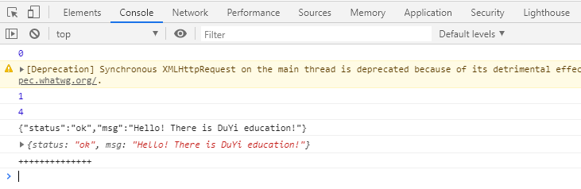
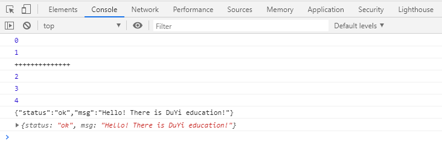
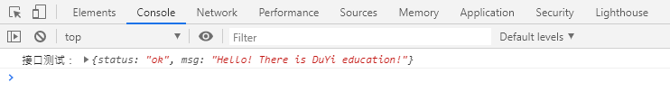
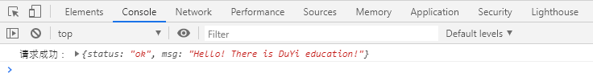

# 实战应用

# 原生 js 发送 Ajax

    <body><divid="test">
</body>

- open 第三个参数传 false，为同步模式

****

- open 第三个参数传 true，或者不传，为异步模式 

\*\*
\*\*

**http 状态码：**

HTTP 状态码由三个十进制数字组成，第一个十进制数字定义了状态码的类型，后两个数字没有分类的作用。

HTTP 状态码共分为 5 种类型：

分类分类描述 1**信息，服务器收到请求，需要请求者继续执行操作 2**成功，操作被成功接收并处理 3**重定向，需要进一步的操作以完成请求 4**客户端错误，请求包含语法错误或无法完成请求 5\*\*服务器错误，服务器在处理请求的过程中发生了错误

# JQuery 发送 jsonp

**jsonp 格式哪里特殊？**

> 发送的时候，会带上一个参数 callback

> 返回的结果不是 json，是 ​ `callback(json);`

**jsonp 跨域，只能使用 get 方法!**

> jsonp 跨域，只能使用 get 方法，如果我们设置的是 post 方法，jquery 会自动转为 get 方法。

**是不是在 jsonp 里面我只能使用 get 方法？是不是我设置的 post 方法都会转为 get 方法？**

> 不是。
>
> jquery 会先判断是否同源，如果同源，那么设置的是 get 就是 get，设置的 post 就是 post。
>
> 如果不是同源（跨域），无论设置的什么，都改为 get。

    <head><metacharset="UTF-8"><title>Title</title><scriptsrc="jquery.js"></script></head>

[📎jquery.js](https://www.yuque.com/attachments/yuque/0/2020/js/714097/1596082748046-e67f1f16-5b2c-4545-a769-ac87873ff896.js)

# jsonP 原理

**JSONP 原理：**

- 前端部分

1.  判断请求与当前页面的域，是否同源，如果同源则发送正常的 ajax，就没有跨域的事情了。
2.  如果不同源，生成一个 script 标签
3.  生成一个随机的 callback 名字，需要自己提前**创建一个名为这个\*\***callba\***\*ck\*\***名字\***\*的方法**。
4.  设置 script 标签的 src，设置为要请求的接口。
5.  将 callback 作为参数拼接在后面。

- 后端部分

1. 后端接收到请求后，开始准备要返回的数据
2. 后端拼接数据，将要返回的数据用 callback 的值和括号包裹起来

> 例如：callback=test，要返回的数据为{"a":1, "b":2},
>
> 就要拼接为：test({"a":1, "b":2});

1.  将内容返回。

- 浏览器部分

1. 浏览器接收到内容，会当做 js 代码来执行。
2. 从而执行名为 test 的方法。这样我们就接收到了后端返回给我们的对象。

**案例：**

    <body><!--因为我想从一个接口获取一个数据但是这个接口和当前页面不是同源的。（也就是跨域了）但是这个接口是支持JSONP的。script标签，有src属性，所以可以发出网络请求script标签，虽然可以引用其他域的资源，浏览器不限制。但是，浏览器会将返回的内容，作为js代码执行。test({"status":"ok","msg":"Hello! There is DuYi education!"})
    相当于调用了test方法，传入了一个json对象作为参数。--><scriptsrc='http://developer.duyiedu.com/edu/testJsonp?callback=test'></script></body>

**jsonP 原理实现:**

    <body></body>

