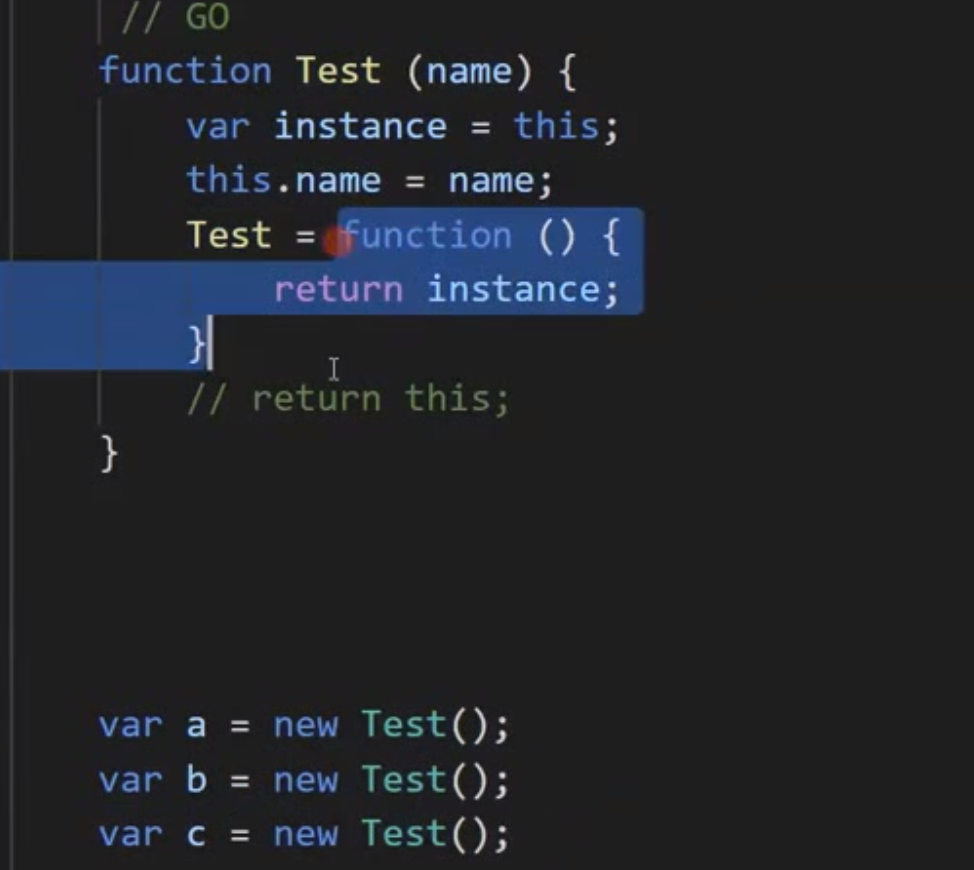
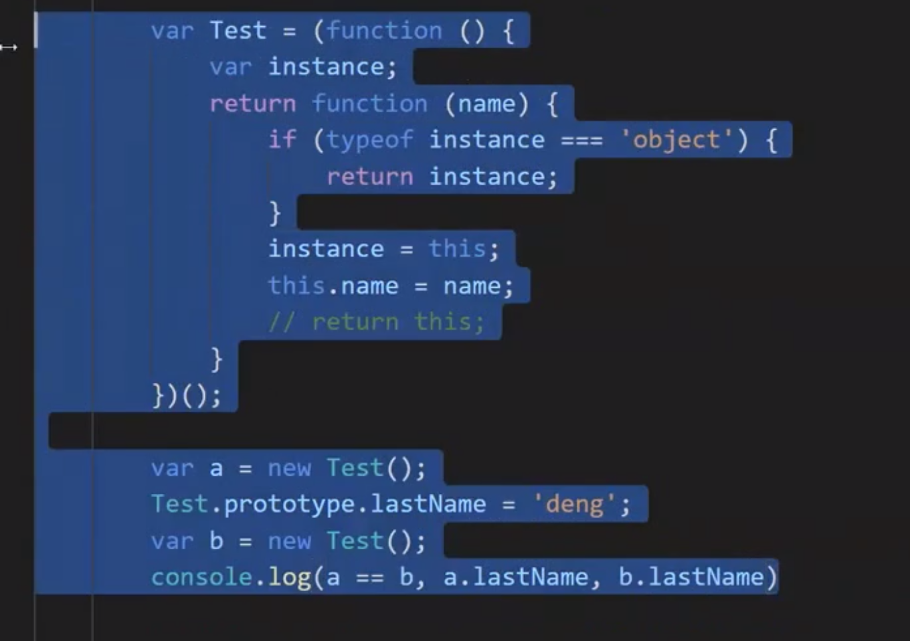
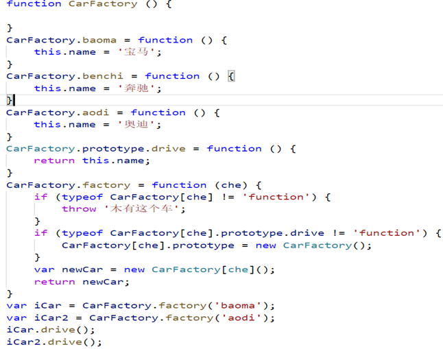

# C2-设计模式详解

# 设计模式

## 单例模式

节约开销。

- 定义

> 保证一个类仅有一个实例，并提供一个访问它的全局访问点。
>
> 无论创建多少个实例，返回的都是同一个实例对象。
>
> 在它的核心结构中只包含一个被称为单例的特殊类。通过单例模式可以保证系统中，应用该模式的类一个类只有一个实例。即一个类只有一个对象实例。

- 实现思想

> 第一次创建一个对象，保存起来；
>
> 第二次、第 N 次创建的时候判断并返回第一个创建的对象。

> 全局变量实现

> 闭包

- getSingle

  functiongetSingle(func) {
  varresult;
  returnfunction() {
  if (!result) {
  result = func.apply(this, arguments);
  }
  returnresult;
  }
  }

## 代理模式

- 定义

> 为一个对象提供一种代理以控制对这个对象的访问。
>
> 代理对象起到类似中介的作用，会增加一些功能（如，校验，合并等等），也会去掉一些原有对象的功能。

- 虚拟代理

> 虚拟代理是把一些开销很大的对象，延迟到真正需要它的时候才去创建执行。
>
> 虚拟代理-图片加载，文件上传

- 安全代理

> 控制真实对象的访问权限。
>
> 保护代理-登录操作后才能看全功能，前端校验

- 远程代理（

> 一个对象将不同空间的对象进行局部代理）。
>
> 远程代理-监控多个对象的状态，总机监控分店

- 智能代理

> （调用对象代理处理另外一些事情如垃圾回收机制增加额外的服务）
>
> 智能代理-提供额外的其他服务 火车站代售处。

**案例：**

- 懒加载

> 占位图片。

- 预加载+懒加载

> 预加载只加载一次占位图片。

- 代理模式-表单验证

> 保护代理就是起到保护作用，用来过滤掉一下不必要的请求，将真正需要的递给本体。

> 譬如，验证用户名是否唯一

> 这里我们应用，保护代理的思想，如果用户名是不合法的，则不会将该请求给本体执行

> 发送 ajax 请求

设计模式-代理模式分析

这样编写代码，的确能够完成业务的需求，能够完成表单的验证，但是存在很多问题

1.绑定的函数比较庞大，包含了很多的 if-else 语句，看着都恶心，这些语句需要覆盖所有的校验规则。

2.绑定的函数缺乏弹性，如果增加了一种新的校验规则，或者想要把密码的长度校验从 6 改成 8，我们都必须深入

3.绑定的函数的内部实现，这是违反了开放-封闭原则的。

4.算法的复用性差，如果程序中增加了另一个表单，这个表单也需要进行一些类似的校验，那我们很可能将这些校验逻辑复制得漫天遍野。

设计模式-代理模式-反模式

不能滥用模式，有时候仅仅是给代码增加复杂度了

## 设计模式-策略模式

策略模式是指对一系列的算法定义，并将每一个算法封装起来，而且使它们还可以相互替换。策略模式让算法独立于使用它的客户而独立变化。

策略模式的优点有：策略模式提供了管理相关的算法族的办法、策略模式提供了可以替换继承关系的办法、使用策略模式可以避免使用多重条件转移语句。

策略模式支持您在运行时选择算法,把他们一个个封装起来，并且使他们可以相互替换。

决定用一个类对象实例来管理规则的校验

该对象要能，相应的主动添加对规则的相应处理办法

校验数据的时候可以相应的返回相关信息

业务复杂达到一定程度了我们才选用设计模式去解决复杂的问题，扩展性 复用性，冗余度，小的情况没必要使用

业务复杂达到一定程度了我们才选用设计模式去解决复杂的问题，扩展性 复用性，冗余度，小的情况没必要使用

## 设计模式-工厂模式

定义:工厂模式定义创建对象的接口，但是让子类去真正的实例化。也就是工厂方法将类的实例化延迟到子类

设计模式-工厂模式-对比其他方式

1.工厂类集中了所有对象的创建，便于对象创建的统一管理

2.对象的使用者仅仅是使用产品，实现了单一职责

3.便于扩展，如果新增了一种业务，只需要增加相关的业务对象类和工厂类中的生产业务对象的方法，不需要修改其他的地方。

4.确实违反了开闭原则

设计模式-工厂方法模式

工厂方法模式：不再有一个唯一的工厂类就创建产品，而是将不同的产品交给对应的工厂子类去实现。每个产品由负责生产的子工厂来创造。如果添加新的产品，需要做的是添加新的子工厂和产品，而不需要修改其他的工厂代码。

1.抽象工厂类：负责定义创建产品的公共接口。

2.产品子工厂：继承抽象工厂类，实现抽象工厂类提供的接口

3.每一种产品各自的产品类

代码比简单工厂模式复杂了，引入了抽象层，还有子工厂，这会增加代码的复杂度和理解难度。但是相比于简单工厂模式，代码的维护性和扩展性提高了，新增产品时，只需要增加对应的产品类和产品工厂类，不需要修改到抽象工厂类和其他子工厂。更加符合面向对象的开放封闭原则。

当然具体场景具体分析，复杂性和扩展性相比如何舍去，在使用的时候要结合实际场景去分析。

## 设计模式-装饰者模式

定义: 在不改变元对象的基础上，通过对其进行包装拓展（添加属性方法）

装饰者(decorator)模式能够在不改变对象自身的基础上，在程序运行期间给对像动态的添加职责。与继承相比，装饰者是一种更轻便灵活的做法。可以当脚本运行时，在子类中增加行为会影响原有类所有的实例，而装饰者却不然。取而代之的是它能给不同对象各自添加新行为

实现: 构造函数需要一个装饰资源池，提供相应的装饰方法，提供添加装饰方法的方法。

## 设计模式-观察者模式

定义:观察者模式，定义对象间的一种一对多的依赖关系，当一个对象的状态发生改变时，所有依赖于它的对象都将得到通知。 事实上，只要你曾经在 DOM 节点上绑定过事件函数，那么你就曾经使用过观察者模式了！

解释说明：作为观察者的你，订阅了一些消息，被观察者在有消息的时候就会通知你，并且把消息给到你。这个模式存在的意义就是解耦，被观察者无需关心你如何处理消息。

事件机制本身就是一种观察者模式

实现一个 Event 模块，发布消息，订阅消息，退订消息

观察者的使用场合就是：当一个对象的改变需要同时改变其它对象，并且它不知道具体有多少对象需要改变的时候，就应该考虑使用观察者模式。
