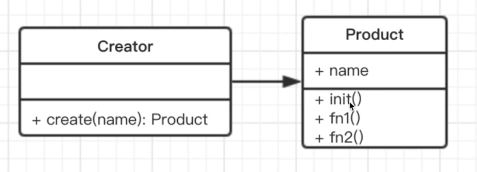
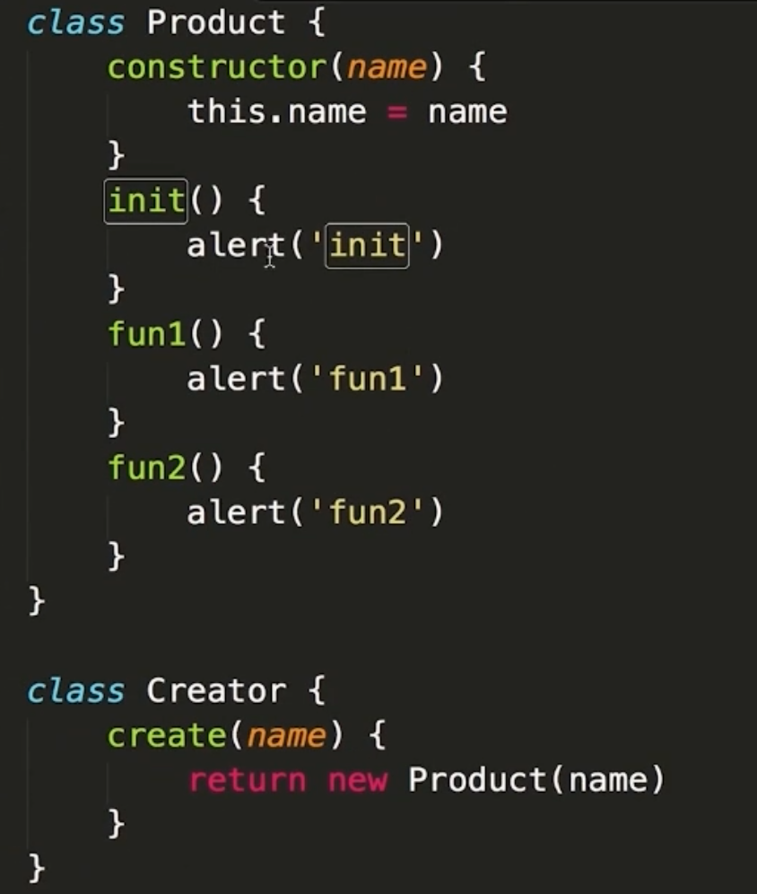
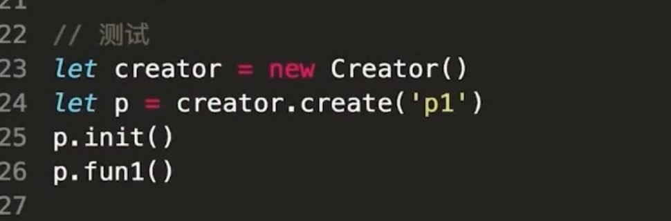
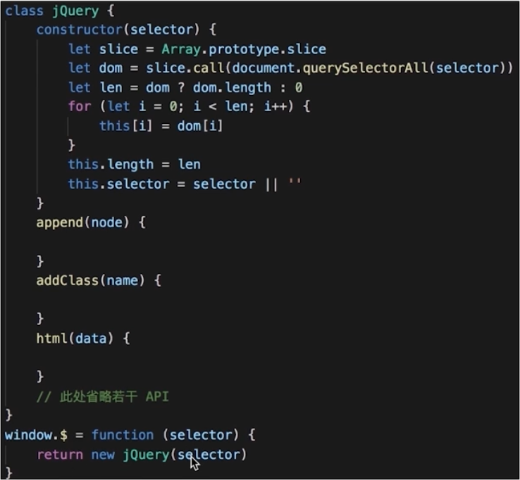
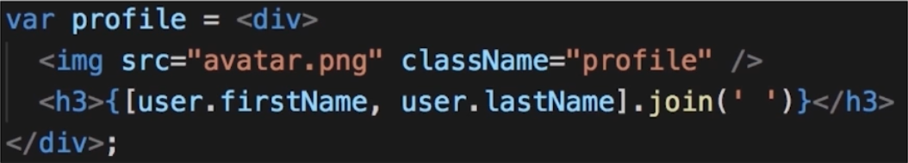
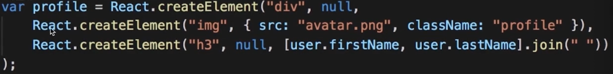
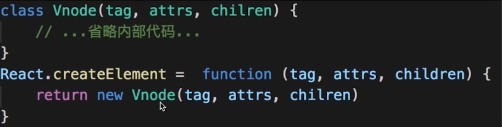
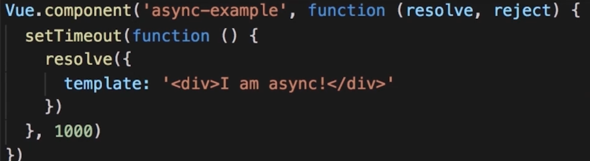

# 工厂模式

# 介绍

将 new 操作符单独封装。

遇到 new 时，考虑是否使用该使用工厂模式。

# 场景

## jQuery: $('div')

**$('div') 和 new $('div') 有何区别？**

第一：书写麻烦，jQuery 的链式操作将会称为噩梦

第二：一旦 jQuery 名字变化，将是灾难性的

## React.createElement

源码：

## vue 异步组件

