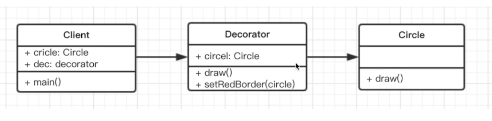
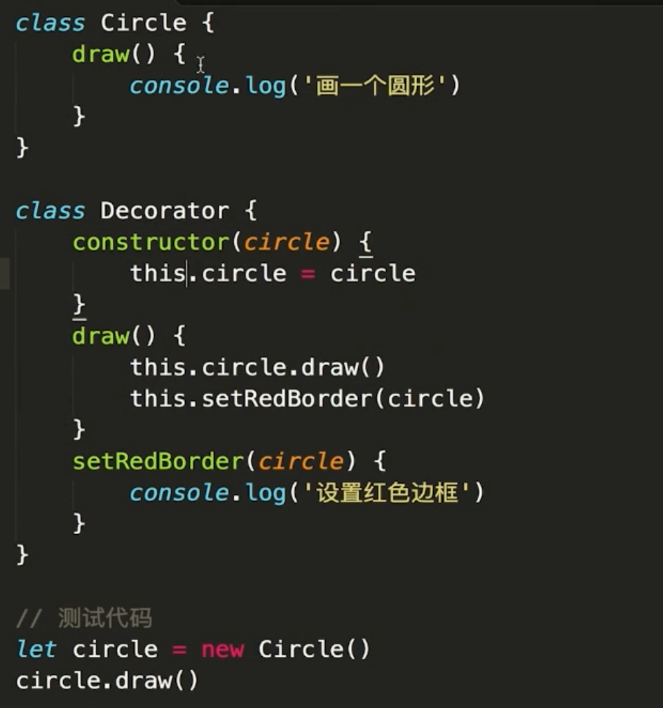
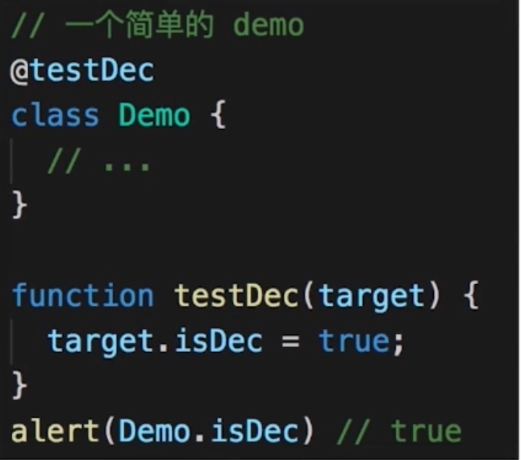
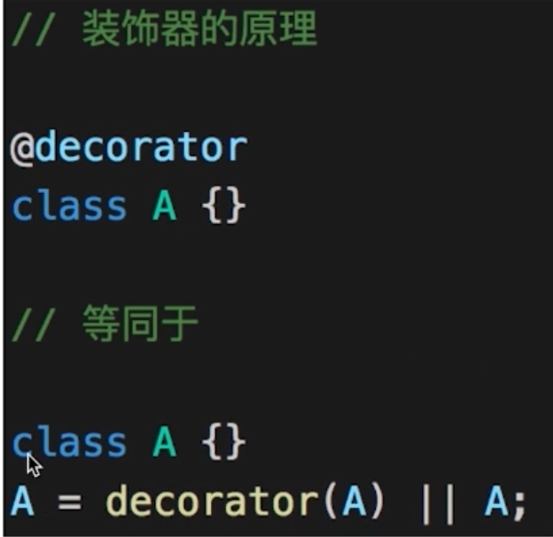
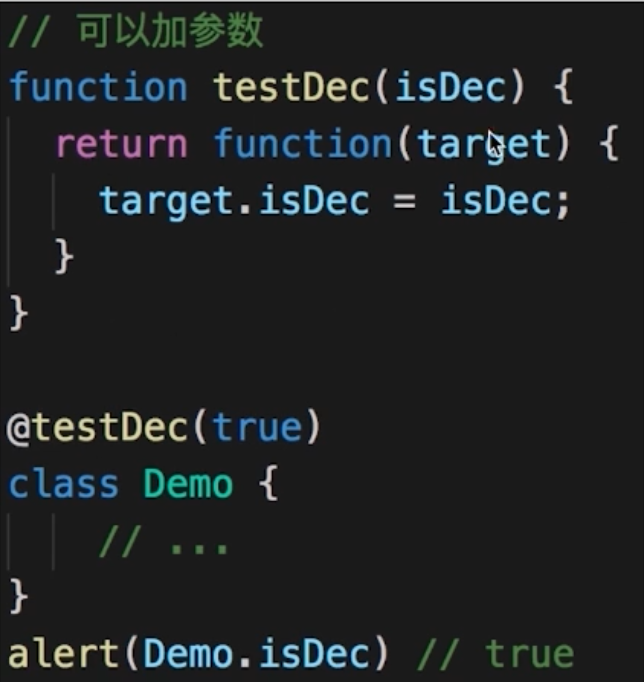
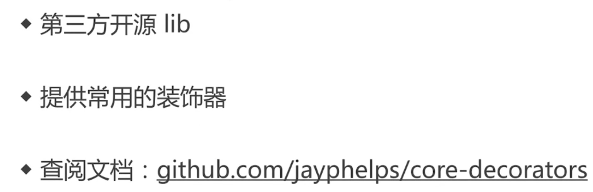

# 装饰器模式

# 介绍

为对象添加新功能。

不改变其原有的结构和功能。

Decorator：装饰器 新增 setRedBorder。

Client：使用者 使用装饰器。

# 场景

## ES7 装饰器

所有的装饰器都是一个函数。

- 装饰类

对 Demo 进行装饰。

传入的 target 就是 Demo。

相当于 A 在 decorator 中执行了一遍。

    function mixins(...list) {
      return function (target) {
        Object.assign(target.prototype, ...list)
      }
    }

    const Foo = {
      foo() { alert('foo') }
    }

    @mixins(Foo)
    class MyClass {}

    let obj = new MyClass();
    obj.foo() // 'foo'

- 装饰方法

  function readonly(target, name, descriptor){
  // descriptor 对象原来的值如下
  // {
  // value: specifiedFunction,
  // enumerable: false,
  // configurable: true,
  // writable: true
  // };
  descriptor.writable = false;
  return descriptor;
  }

  class Person {
  constructor() {
  this.first = 'A'
  this.last = 'B'
  }

        @readonly
        name() { return `${this.first} ${this.last}` }

  }

  var p = new Person()
  console.log(p.name())
  p.name = function () {} // 这里会报错，因为 name 是只读属性

案例 2：

    function log(target, name, descriptor) {
      var oldValue = descriptor.value;

      descriptor.value = function() {
        console.log(`Calling ${name} with`, arguments);
        return oldValue.apply(this, arguments);
      };

      return descriptor;
    }

    class Math {
      @log
      add(a, b) {
        return a + b;
      }
    }

    const math = new Math();
    const result = math.add(2, 4);
    console.log('result', result);

## core-decorators

npm i core-decorators --save

    import { readonly } from 'core-decorators'

    class Person {
        @readonly
        name() {
            return 'zhang'
        }
    }

    let p = new Person()
    alert(p.name())
    // p.name = function () { /*...*/ }  // 此处会报错

    import { deprecate } from 'core-decorators';

    class Person {
      @deprecate
      facepalm() {}

      @deprecate('We stopped facepalming')
      facepalmHard() {}

      @deprecate('We stopped facepalming', { url: 'http://knowyourmeme.com/memes/facepalm' })
      facepalmHarder() {}
    }

    let person = new Person();

    person.facepalm();
    // DEPRECATION Person#facepalm: This function will be removed in future versions.

    person.facepalmHard();
    // DEPRECATION Person#facepalmHard: We stopped facepalming

    person.facepalmHarder();
    // DEPRECATION Person#facepalmHarder: We stopped facepalming
    //
    //     See http://knowyourmeme.com/memes/facepalm for more details.
