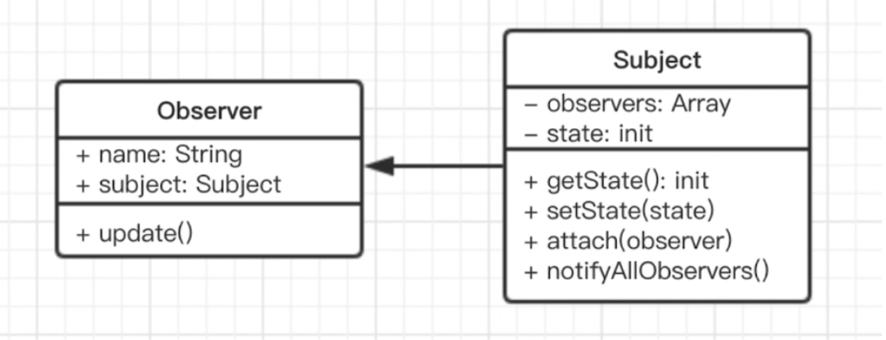

# 观察者模式

# 介绍

发布 & 订阅。

一对多。

    // 主题，接收状态变化，触发每个观察者
    class Subject {
        constructor() {
            this.state = 0
            this.observers = []
        }
        getState() {
            return this.state
        }
        setState(state) {
            this.state = state
            this.notifyAllObservers()
        }
        attach(observer) {
            this.observers.push(observer)
        }
        notifyAllObservers() {
            this.observers.forEach(observer => {
                observer.update()
            })
        }
    }

    // 观察者，等待被触发
    class Observer {
        constructor(name, subject) {
            this.name = name
            this.subject = subject
            this.subject.attach(this)
        }
        update() {
            console.log(`${this.name} update, state: ${this.subject.getState()}`)
        }
    }

    // 测试代码
    let s = new Subject()
    let o1 = new Observer('o1', s)
    let o2 = new Observer('o2', s)
    let o3 = new Observer('o3', s)

    s.setState(1)
    s.setState(2)
    s.setState(3)

# 演示

# 场景

## 网页事件绑定

## Promise

## jQuery callbacks

## nodejs 自定义事件

## 其他

nodejs 中：处理 http 请求；多进程通讯

vue 和 React 组件生命周期触发

vue watch

# 总结

