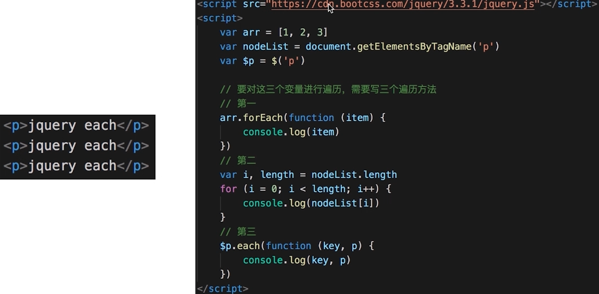
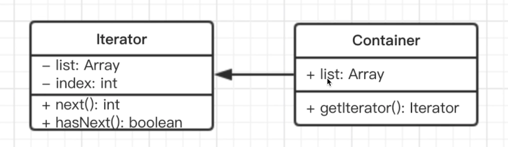
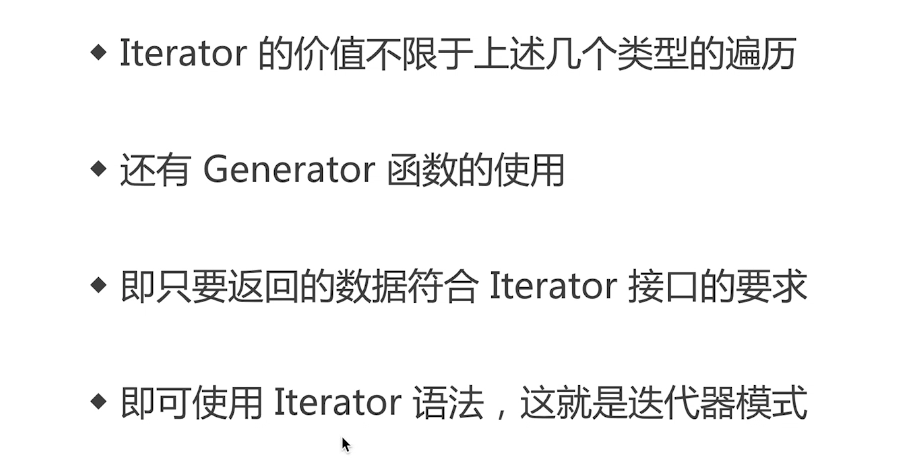

# 迭代器模式

# 介绍

顺序访问一个集合。

使用者无需知道集合的内部结构（封装）。

    <!DOCTYPE html>
    <html>
    <head>
        <meta charset="UTF-8">
        <title>Document</title>
    </head>
    <body>
        
jquery each

        
jquery each

        
jquery each

        
        
    </body>
    </html>

# 演示

    class Iterator {
        constructor(conatiner) {
            this.list = conatiner.list
            this.index = 0
        }
        next() {
            if (this.hasNext()) {
                return this.list[this.index++]
            }
            return null
        }
        hasNext() {
            if (this.index >= this.list.length) {
                return false
            }
            return true
        }
    }

    class Container {
        constructor(list) {
            this.list = list
        }
        getIterator() {
            return new Iterator(this)
        }
    }

    // 测试代码
    let container = new Container([1, 2, 3, 4, 5])
    let iterator = container.getIterator()
    while(iterator.hasNext()) {
        console.log(iterator.next())
    }

# 场景

## ES6 Iterator

ES6 语法中，有序集合的数据类型已经有很多。

Array、Map、Set、String、TypedArray、arguments、NodeList。

需要有一个统一的遍历接口来遍历所有数据类型。

以上数据类型，都有 [symbol.iterator]属性。

属性值是函数，执行函数返回一个迭代器。

迭代器有 next 方法，可顺序迭代子元素。

注意：object 不是有序集合，可以用 Map 代替。

    let arr = [1, 2, 3, 4]
    let nodeList = document.getElementsByTagName('p')
    let m = new Map()
    m.set('a', 100)
    m.set('b', 200)

    function each(data) {
        for (let item of data) {
            console.log(item)
        }
    }

    each(arr)
    each(nodeList)
    each(m)

## ES6 Iterator 与 Generator

