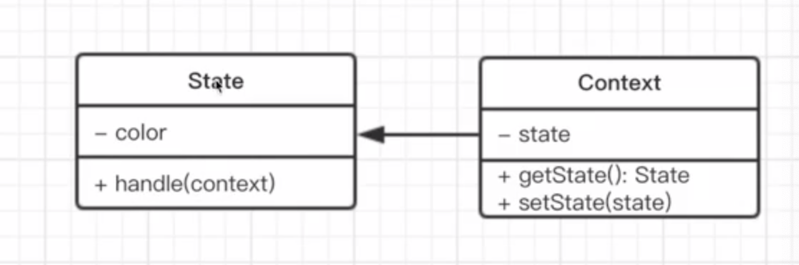
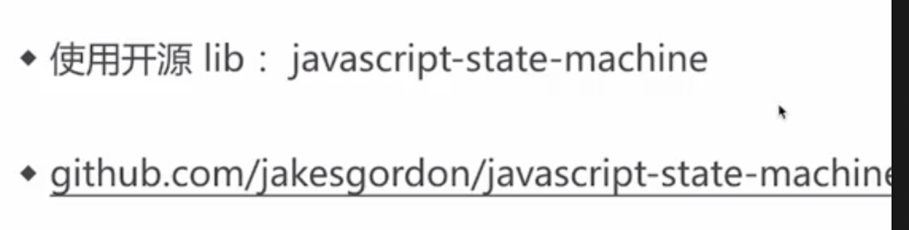
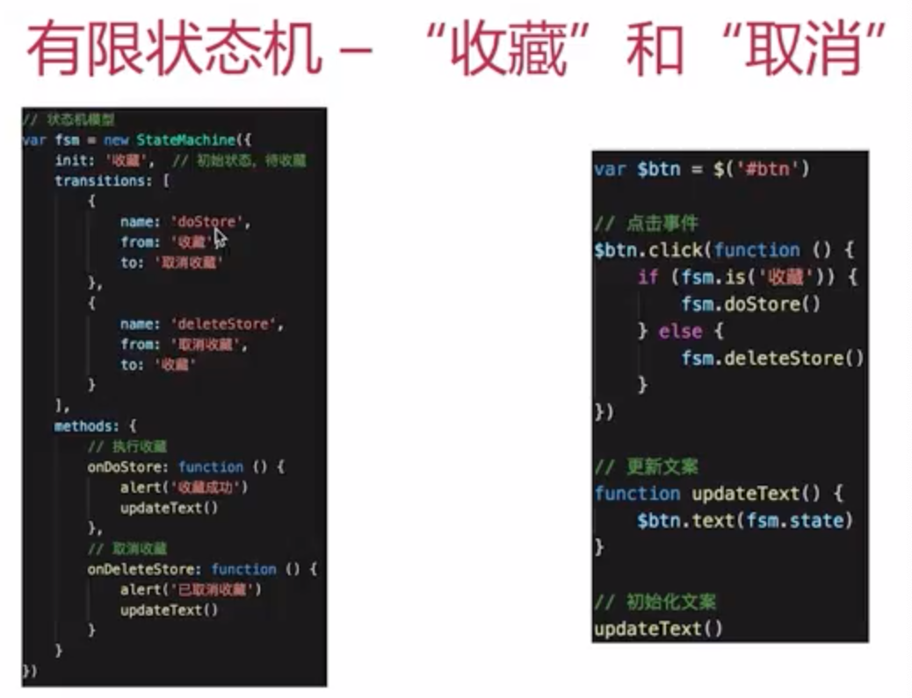

# 状态模式

# 介绍

一个对象有状态变化。

每次状态变化都会触发一个逻辑。

不能总是用 if else 来控制。

    class State {
        constructor(color) {
            this.color = color
        }
        handle(context) {
            console.log(`turn to ${this.color} light`)
            context.setState(this)
        }
    }

    class Context {
        constructor() {
            this.state = null
        }
        setState(state) {
            this.state = state
        }
        getState() {
            return this.state
        }
    }

    // 测试代码
    let context = new Context()

    let greed = new State('greed')
    let yellow = new State('yellow')
    let red = new State('red')

    // 绿灯亮了
    greed.handle(context)
    console.log(context.getState())
    // 黄灯亮了
    yellow.handle(context)
    console.log(context.getState())
    // 红灯亮了
    red.handle(context)
    console.log(context.getState())

# 场景

## 有限状态机

有限个状态、以及在这些状态之间的变化。

## Promise

[https://pan.baidu.com/play/video#/video?path=%2F%E8%AF%BE%E7%A8%8B%2Fmk005-ms%20-%20Javascript%20%E8%AE%BE%E8%AE%A1%E6%A8%A1%E5%BC%8F%E7%B3%BB%E7%BB%9F%E8%AE%B2%E8%A7%A3%E4%B8%8E%E5%BA%94%E7%94%A8%2F%E7%AC%AC12%E7%AB%A0%20%E7%8A%B6%E6%80%81%E6%A8%A1%E5%BC%8F%2F12-3%20%E7%8A%B6%E6%80%81%E6%A8%A1%E5%BC%8F-%E5%9C%BA%E6%99%AF2(%E5%86%99%E4%B8%80%E4%B8%AApromise).mp4&t=2](<https://pan.baidu.com/play/video#/video?path=%2F%E8%AF%BE%E7%A8%8B%2Fmk005-ms%20-%20Javascript%20%E8%AE%BE%E8%AE%A1%E6%A8%A1%E5%BC%8F%E7%B3%BB%E7%BB%9F%E8%AE%B2%E8%A7%A3%E4%B8%8E%E5%BA%94%E7%94%A8%2F%E7%AC%AC12%E7%AB%A0%20%E7%8A%B6%E6%80%81%E6%A8%A1%E5%BC%8F%2F12-3%20%E7%8A%B6%E6%80%81%E6%A8%A1%E5%BC%8F-%E5%9C%BA%E6%99%AF2(%E5%86%99%E4%B8%80%E4%B8%AApromise).mp4&t=2>)
