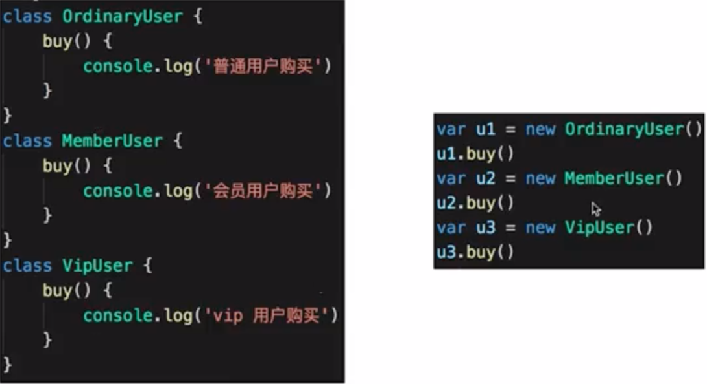

# 其他设计模式

不常用。

对应不到经典的应用场景。

# 创建型

## 原型模式

clone 自己，生成一个新对象。

# 结构型

## 桥接模式

## 组合模式

生成树形结构，表示 整体-部分 的关系。

让整体和部分都具有一致的操作方式。

虚拟 DOM 中的 Vnode 是这种形式，但数据类型简单。

整体和单个节点的操作是一致的

整体和单个的数据结构也保持一致。

## 享元模式

相同的数据，共享使用。

## 行为型

## 策略模式

不同策略分开处理。

避免出现大量 if else 或者 switch case

## 模板方法模式

## 职责链模式

## 命令模式

执行命令是，发布者和执行者分开。

中间加入命令对象，作为中转站。

## 备忘录模式

## 中介者模式

## 访问者模式

## 解释器模式

