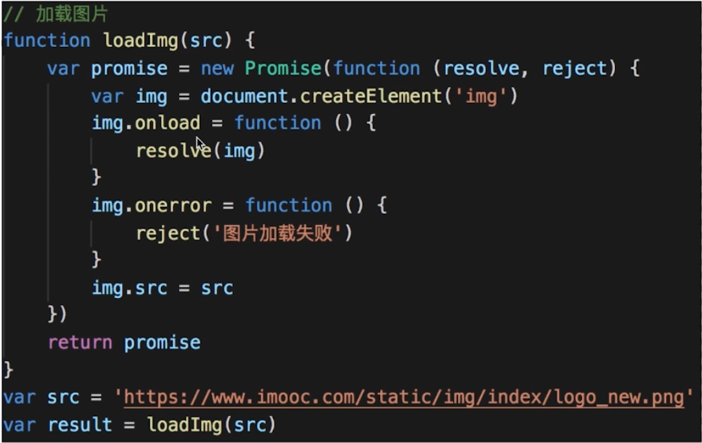
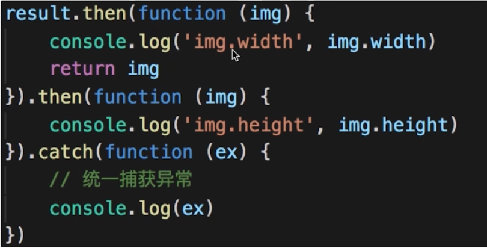

# 设计原则

# UNIX/LINUX 设计哲学

**大准则：**

1. 小即是美
2. 让每个程序只做好一件事
3. 快速建立原型（快速搭建最基本的功能）
4. 舍弃高效率而取可移植性
5. 采用纯文本来存储数据
6. 充分利用软件的杠杆效应（软件复用）
7. 使用 shell 脚本来提高杠杆效应和可移植性
8. 避免强制性的用户界面
9. 让每个程序都称为过滤器

**小准则：**

允许用户定制环境。

尽量使操作系统内核小而轻量化。

沉默是金。

各部分之和大于整体。

寻求 90%的解决方案。

## S O L I D 五大设计原则

## S - 单一职责原则

一个程序只做好一件事。

如果功能过于复杂就拆分开，每个部分保持独立。

## O - 开放封闭原则

对扩展开放，对修改封闭。

增加需求时，扩展新代码，而非修改已有代码。

这是软件设计的终极目标。

## L - 李氏置换原则

子类能覆盖父类。

父类能出现的地方子类就能出现。

JS 中使用较少（弱类型 & 继承使用较少）。

## I - 接口独立原则

保持接口的单一独立，避免出现“胖接口”。

## D - 依赖倒置原则

面向接口编程，依赖于抽象而不依赖于具体。

使用方只关注接口，而不关注具体类的实现。

JS 中使用较少（没有接口 & 弱类型）。

## 总结

S O 体现较多。

L I D 体现较少。

**用 Promise 来说明 S O：**

S-单一职责原则：每个 then 中的逻辑只做好一件事。

O-开放封闭原则：如果新增需求，扩展 then。

## 从设计到模式

## 创建型

工厂模式（工厂方法模式、抽象工厂模式、建造者模式）

单例模式

原型模式

## 结构型

适配器模式

装饰器模式

代理模式

外观模式

桥接模式

组合模式

享元模式

## 行为型

策略模式

模板方法模式

观察者模式

迭代器模式

职责链模式

命令模式

备忘录模式

状态模式

访问者模式

中介者模式

解释器模式
