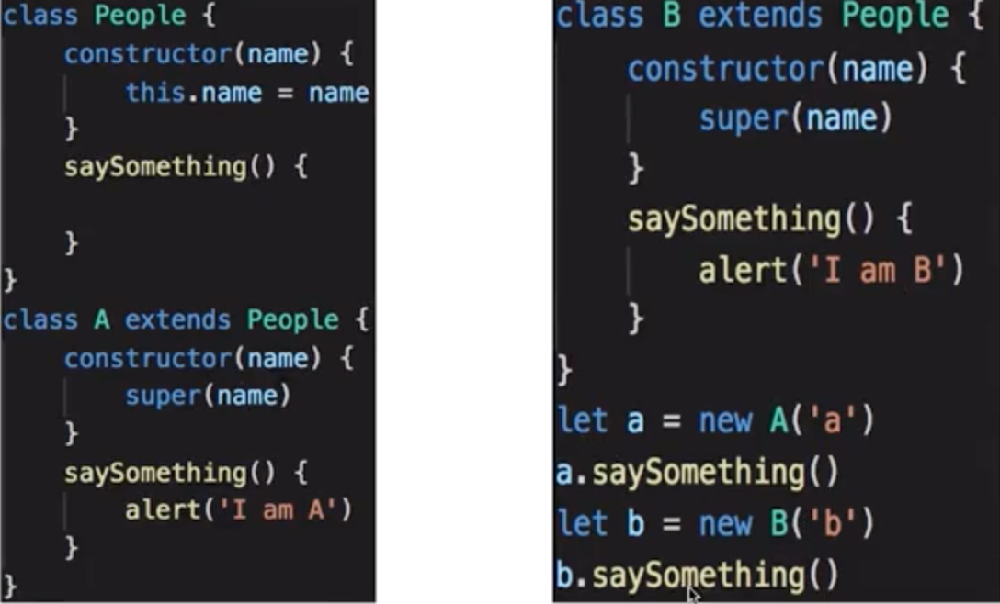
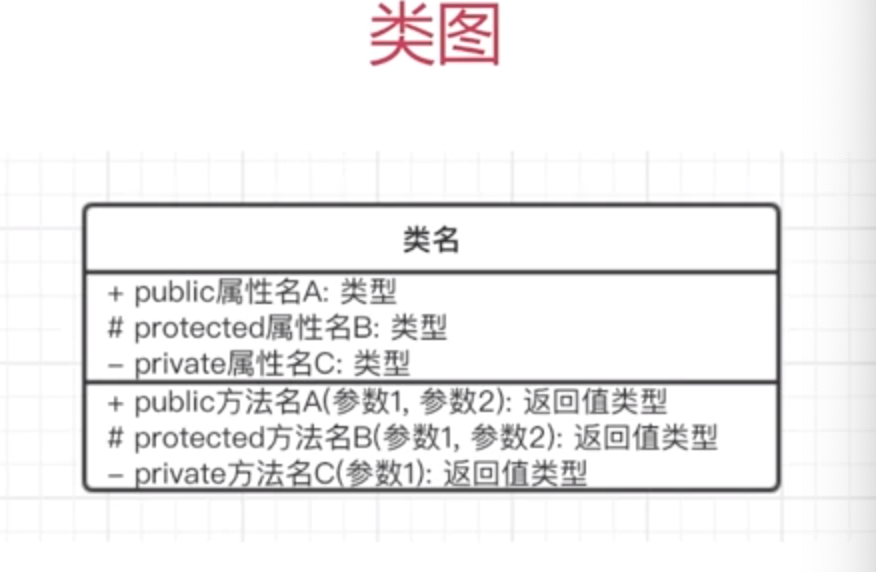

# 什么是面向对象？

# 什么是面向对象？

## 三要素

- 继承

子类继承父类。

- 封装

数据的权限和保密。

减少外露，不该外漏的不外露。

利于数接口的权限管理。

ES6 目前不支持，一般认为 `_开头`的属性是 private

- 多态

同一接口不同实现。

JS 应用极少。

需要结合 Java 等语言的接口、重写、重载等功能。

## 应用举例

## 为什么使用面向对象？

程序执行：顺序、判断、循环 -- 结构化

面向对象：数据结构化

对于计算机，机构化的才是最简单的。

编程应该 简单&抽象。

# UML

Unified Modeling Language 统一建模语言。

类图，UML 包含很多种图，和本课相关的是类图。

关系，主要讲解泛化和关联。

- 画图工具

MS Office Visio

processon

## 类图

一列 3 行：分别是 类名、属性、方法。

- 案例

## 类图的关系

泛化：表示继承（空箭头）

关联：表示引用 （实心箭头）

