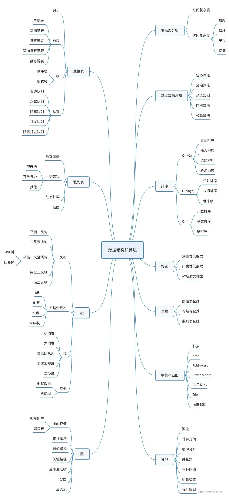

# （一）数据结构与算法简介

# 数据结构与算法的关系

- 数据结构

可以容乃数据的结构被成为数据结构。(计算机存储、组织数据的方式，就像`锅碗瓢盆`）

- 算法

算法是用来对数据结构进行处理的方法。（一系列解决问题的清晰指令，就像`食谱`）

从广义上讲，数据结构就是指一组数据的`存储结构`。算法就是操作数据的一组`方法`。

## 20 个常见数据结构、算法

- 10 个数据结构

数组、链表、栈、队列、散列表、二叉树、堆、跳表、图、Trie 树

- 10 个算法

递归、排序、二分查找、搜索、哈希算法、字符串匹配算法、分治算法、动态规划、贪心算法、回溯算法

- 算法设计思想

分而治之、动态规划、贪心、回溯

## 总览

# 结语

希望本文对你有一点点帮助，另外，求个赞，谢谢！ \_
