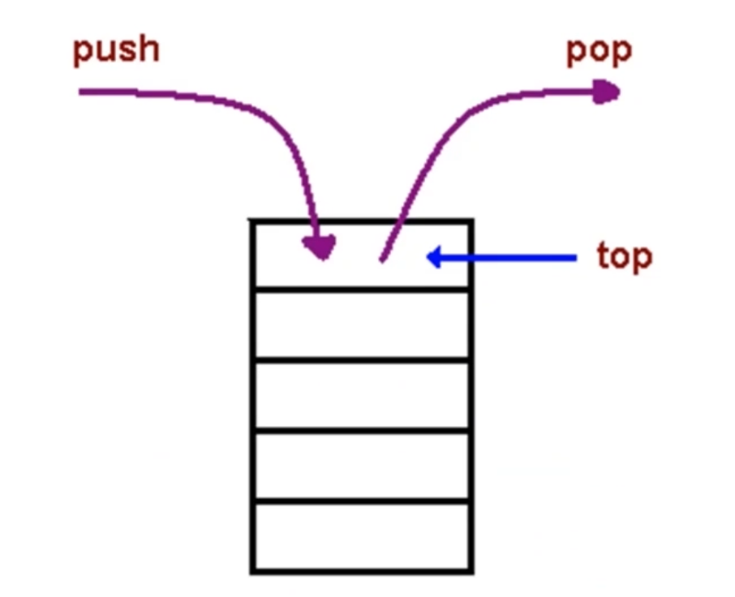
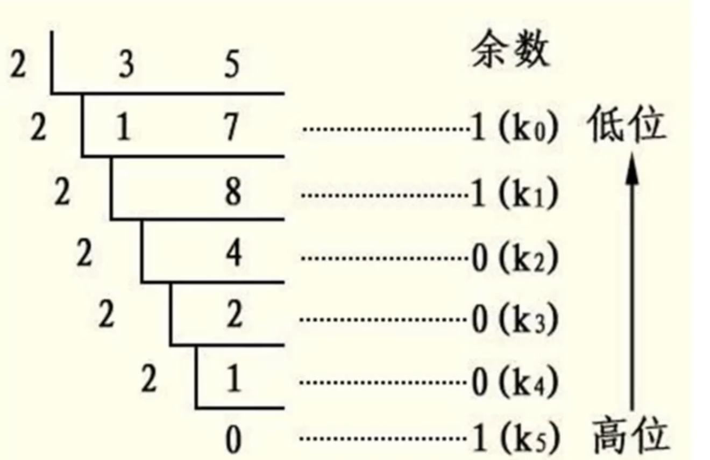

# （三）数据结构之“栈”

---

## theme: orange

# 栈是什么

一种`后进先出`的数据结构。

JavaScript 中没有栈，但可以用 Array 实现栈的所有功能。

    const stack = []
    stack.push(1)
    stack.push(2)
    stack.push(3)

    console.log(stack.pop()) // 3

# 什么场景下用栈？

需要后进先出的场景。

比如：`十进制转二进制`、`判断字符串的括号是否有效`、`函数调用堆栈`...

## 场景一：十进制转二进制

后出来的余数反而要排到前面。

把余数依次入栈，然后再出栈，就可以实现余数倒序输出。

    // 场景一：正整数 十进制转二进制
    function decbin(num) {
        const stack = []
        let x = parseInt(num / 2) // 商
        let y = num % 2 // 余数

        while(x) {
            stack.push(y)
            x = parseInt(x / 2)
            y = num % 2
        }
        x === 0 && stack.push(1)
        return stack
    }

    const stack_1 = decbin(7)
    while(stack_1.length) {
        console.log(stack_1.pop())
    }

## 场景二：有效的括号

越靠后的左括号，对应的右括号越靠前。

循环字符串，遇到左括号入栈，遇到右括号出栈，最后栈空了就是合法的。

    // 场景二：有效的括号
    function validBacket(str) {
        const stack = []

        for(let s of str) {
            if (s === '(') {
                stack.push('(')
            }
            if (s === ')') {
                stack.pop()
            }
        }
        return stack.length === 0
    }

    const str = '()()()((()))'
    console.log(validBacket(str))

## 场景三：函数调用堆栈

最后调用的函数，最先执行完。

JS 解释器使用栈来控制函数的调用顺序。

    function func1() {
        func2()
    }

    function func2() {
        func3() // 栈顶：最后调用的函数，最先执行完。
    }

    function func3() {}

    func1()

# LeetCode：20.有效的括号

[20. 有效的括号 - 力扣（LeetCode） (leetcode-cn.com)](https://leetcode-cn.com/problems/valid-parentheses/)

## 解题思路

对于没有闭合的左括号而言，越靠后的左括号，对应的右括号越靠前；
满足后进先出，考虑用栈。

1. 新建一个栈
2. 扫描字符串，遇到`左括号入栈`，遇到和`栈顶括号类型匹配`的`右括号`就出栈，类型不匹配直接判定为不合法。
3. 栈空了就是合法

   /\*\*

   - @param {string} s
   - @return {boolean}
     \*/
     var isValid = function(s){
     const stack = []
     const backetMap = {
     '(': ')',
     '[': ']',
     '{': '}'
     }
     const backetArr = ['(', '[', '{']
     for(let c of s) {
     if (backetArr.includes(c)) {
     stack.push(c)
     } else {
     const top = stack[stack.length - 1]
     if (c === backetMap[top]) {
     stack.pop()
     } else {
     return false
     }
     }
     }
     return stack.length === 0
     }

## 复杂度

- 时间复杂度：O(N)
- 空间复杂度：O(N)
