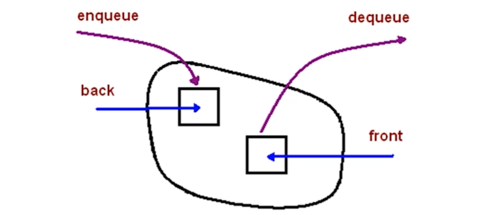
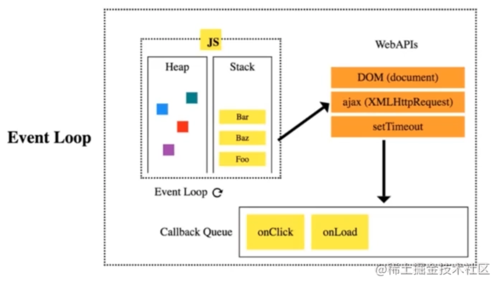

# （四）数据结构之“队列”

---

## theme: orange

# 队列是什么

一种`先进先出`的数据结构。

JavaScript 中没有队列，但可以用 Array 实现队列的所有功能。

    const queue =[]
    // 入队
    queue.push(1)
    queue.push(2)

    // 出队
    queue.shift()

# 什么场景用队列?

需要`先进先出`的场景。

比如：JS 异步中的任务队列、计算最近请求次数。

## 事件循环与任务队列

- `Event Loop`
  一段 JS 代码刚执行的时候，会有一个`匿名的主事件`，会丢到 Callback Queue 中。

JS 引擎会取`Callback Queue`里面的事件来执行；因为 JS 是单线程的，在执行这个事件的过程中，如果有一些`异步任务，会丢给WebAPI`来执行。

WebAPI 在执行这个异步任务`结束`的时候，会把异步任务中的`回调函数`，再放到`Callback Queue`中。

`Callback Queue`中，如果前面的事件都执行完了，`回调函数的代码`就会继续放到`JS引擎`中执行。

如果回调函数中还有异步任务，就继续这个循环。整个过程就是事件循环。

# LeetCode：933. 最近的请求次数

[933. 最近的请求次数 - 力扣（LeetCode） (leetcode-cn.com)](https://leetcode-cn.com/problems/number-of-recent-calls/)

## 解题思路

    输入：
    ["RecentCounter", "ping", "ping", "ping", "ping"]
    [[], [1], [100], [3001], [3002]]
    输出：
    [null, 1, 2, 3, 3]

越早发出的请求，越早不在最近的 3000ms 内的请求里；
满足先进先出，考虑用队列。

1.  有新请求就入队；
2.  判断如果队首，是 3000ms 前发出的请求，出队；
3.  队列的长度就是最近请求次数；

    var RecentCounter = function() {
    this.queue = []
    };

    /\*\*

    - @param {number} t
    - @return {number}
      \*/
      RecentCounter.prototype.ping = function(t) {
      this.queue.push(t)
      while(t - this.queue[0] > 3000) {
      this.queue.shift()
      }
      return this.queue.length
      }

## 复杂度

- 时间复杂度 O(N)
- 空间复杂度 O(N)
