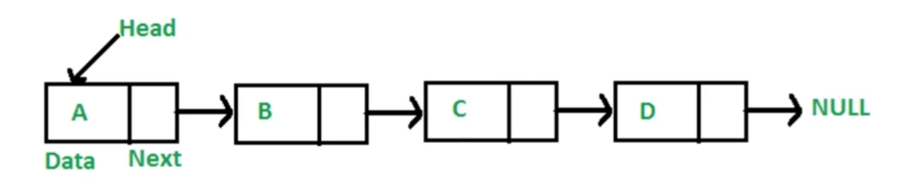
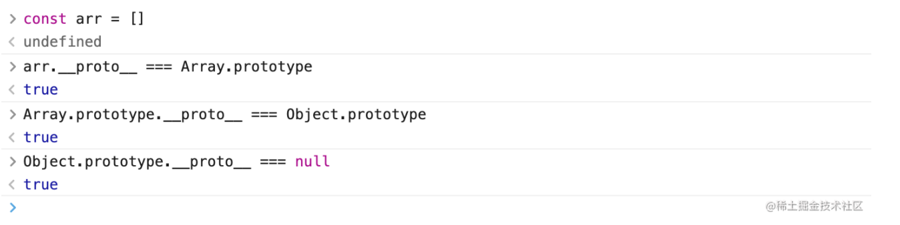

# （五）数据结构之“链表”

---

## theme: orange

# 链表是什么

多个元素组成的列表。

元素存储不连续，用`next`指针连在一起。

## 数组 VS 链表

### 数组

- 数组的特点

存储在物理空间上是连续的。

底层的数组长度是不可变的。

数组的变量，指向了数组第一个元素的位置。a[0]，`[]` 方括号表示存储地址的偏移。（通过偏移查询数据性能最好）

- 优点

通过偏移指定查询某个位置，查询性能好。

- 缺点

因为空间必须得是连续的，所以如果数组比较大，当系统的空间碎片较多的时候，容易存不下。

因为数组的长度是固定的，所以数组的内容难以被添加和删除。

### 链表

- 链表的特点

空间上不是连续的。

每存放一个值，都要多开销一个引用空间。

- 优点

只要内存足够大，就能存的下，不用担心空间碎片问题。

链表的添加和删除非常的容易。

- 缺点

查询速度慢。（指的查询某个位置）

链表每一个节点都需要创建一个指向 next 的引用，浪费一些空间。当节点内数据越多的时候，这部分内存开销的影响越小。

- 注意

每一个节点，都认为自己是根节点。

## JS 中的链表

### 定义

    // 定义：链表节点构造函数
    function Node(value) {
        this.value = value
        this.next = null
    }

    let a = new Node('a')
    let b = new Node('b')
    let c = new Node('c')
    a.next = b
    b.next = c
    c.next = null
    console.log(a) /**  Node {
        value: 'a',
        next: Node { value: 'b', next: Node { value: 'c', next: null } }
      }
     */

### 遍历

     // 循环遍历
    function cycleLink(root) {
        let temp = root;
        while(temp) {
            console.log(temp.value);
            temp = temp.next
        }
    }

### 插入

    let d = new Node('d')
    a.next = d
    d.next = b
    console.log(a) /**Node {
        value: 'a',
        next: Node { value: 'd', next: Node { value: 'b', next: Node { value: 'c', next: null } } }
      }
     */

### 删除

    a.next = b

# LeetCode：237.删除链表中的节点

[237. 删除链表中的节点 - 力扣（LeetCode） (leetcode-cn.com)](https://leetcode-cn.com/problems/delete-node-in-a-linked-list/)

## 解题思路

无法直接获取被删除节点的上个节点。

将被删除节点转移到下个节点。

1.  将被删节点的值改为下个节点的值。
2.  删除下个节点。

    /\*\*

    - Definition for singly-linked list.
    - function ListNode(val) {
    -     this.val = val;
    -     this.next = null;
    - }
      \*/
      /\*\*
    - @param {ListNode} node
    - @return {void} Do not return anything, modify node in-place instead.
      \*/
      var deleteNode = function(node) {
      if(node.next === null) {
      return
      }
      node.val = node.next.val
      node.next = node.next.next
      };

## 复杂度

- 时间复杂度：O(1)
- 空间复杂度：O(1)

# LeetCode： 206.反转链表

[206. 反转链表 - 力扣（LeetCode） (leetcode-cn.com)](https://leetcode-cn.com/problems/reverse-linked-list/)

## 解题思路

- 反转两个节点

将 n+1 的 next 指向 n。

    输入：...->n->n+1->...
    输出：...->n+1->n->...

- 反转多个节点

双指针遍历链表，重复上述操作。

    输入：1->2->3->4->5->NULL
    输出：5->4->3->2->1->NULL

1.  双指针一前一后遍历链表
2.  反转双指针

    /\*\*

    - Definition for singly-linked list.
    - function ListNode(val, next) {
    -     this.val = (val===undefined ? 0 : val)
    -     this.next = (next===undefined ? null : next)
    - }
      \*/
      /\*\*
    - @param {ListNode} head
    - @return {ListNode}
      \*/
      var reverseList = function(head) {
      if (!head) {
      return head
      }
      let cur = null
      let next = head
      while(next) {
      let newNext = next.next
      next.next = cur
      cur = next
      next = newNext
      }
      return cur
      };

## 复杂度

- 时间复杂度：O(N)
- 空间复杂度：O(1)

# LeetCode：2. 两数相加

[2. 两数相加 - 力扣（LeetCode） (leetcode-cn.com)](https://leetcode-cn.com/problems/add-two-numbers/)

## 解题思路

    输入： l1 = [2,4,3], l2 = [5,6,4]
    输出： [7,0,8]
    解释： 342 + 465 = 807.

1.  新建一个`空链表`
2.  遍历被相加的两个链表，模拟相加操作，将`个位`追加到新链表上，将`十位`留到下一位去相加。

    /\*\*

    - Definition for singly-linked list.
    - function ListNode(val, next) {
    -     this.val = (val===undefined ? 0 : val)
    -     this.next = (next===undefined ? null : next)
    - }
      \*/
      /\*\*
    - @param {ListNode} l1
    - @param {ListNode} l2
    - @return {ListNode}
      \*/
      var addTwoNumbers = function(l1, l2) {
      let next1 = l1
      let next2 = l2
      let l3 = new ListNode()
      let next3 = l3
      // 十位
      let flag = 0
      while(next1 || next2) {
      let val1 = next1 ? next1.val : 0
      let val2 = next2 ? next2.val : 0
      let val = val1 + val2 + flag
      flag = val >= 10 ? 1 : 0
      next3.next = new ListNode(val % 10)
      next1 = next1 && next1.next
      next2 = next2 && next2.next
      next3 = next3.next
      }
      flag === 1 && (next3.next = new ListNode(1))
      return l3.next
      }

## 复杂度

- 时间复杂度：`O(N)`
- 空间复杂度：`O(N)`

# LeetCode：83. 删除排序链表中的重复元素

[83. 删除排序链表中的重复元素 - 力扣（LeetCode） (leetcode-cn.com)](https://leetcode-cn.com/problems/remove-duplicates-from-sorted-list/)

## 解题思路

因为链表是有序的，所以重复元素一定响铃。

遍历链表，如果发现当前元素和下一个元素值`相同`，就`删除下一个元素值`。

1.  遍历链表，如果发现当前元素和下一个元素值`相同`，就`删除下一个元素值`。
2.  遍历结束后，返回原链表的头部。

    /\*\*

    - Definition for singly-linked list.
    - function ListNode(val, next) {
    -     this.val = (val===undefined ? 0 : val)
    -     this.next = (next===undefined ? null : next)
    - }
      \*/
      /\*\*
    - @param {ListNode} head
    - @return {ListNode}
      \*/
      var deleteDuplicates = function(head) {
      if (!head) {
      return head
      }
      let cur = head
      let next = cur.next

          while(next) {
              // 当前元素和下一个元素值相同，删除下一个元素值。
              if (cur.val === next.val) {
                  cur.next = next.next
              } else {
                  cur = next
              }
              next = cur.next
          }
          return head

      };

## 复杂度

- 时间复杂度：O(N)
- 空间复杂度：O(1)

# LeetCode：141. 环形链表

[141. 环形链表 - 力扣（LeetCode） (leetcode-cn.com)](https://leetcode-cn.com/problems/linked-list-cycle/)

## 解题思路

用一快一慢两个指针遍历链表，如果指针能够相遇，那么链表就有圈。

1.  用`一快一慢`两个指针遍历链表，如果指针能够`相遇`，就返回`true`；
2.  遍历结束后，还没有相遇就返回 false

    /\*\*

    - Definition for singly-linked list.
    - function ListNode(val) {
    -     this.val = val;
    -     this.next = null;
    - }
      \*/

    /\*\*

    - @param {ListNode} head
    - @return {boolean}
      \*/
      var hasCycle = function(head) {
      let p1 = head
      let p2 = head
      while(p1 && p2 && p2.next) {
      p1 = p1.next
      p2 = p2.next.next
      // 再次相遇，有环
      if (p1 === p2) {
      return true
      }
      }
      return false
      }

## 复杂度

- 时间复杂度：O(N)
- 空间复杂度：O(1)

# 前端与链表：JS 中的原型链

## 原型链

原型链的本质是`链表`。

原型链上的`节点`是各种原型对象，比如：`Function.prototype`、`Object.prototype`...

原型链通过`__proto__` 属性连接各种原型对象。

## instanceof 原理

如果 A 沿着原型链能找到`B.prototype`，那么 A instanceof B 为 true（`A 是B的实例`）。

1. 遍历 A 的原型链，如果找到 B.prototype，返回 true，否则返回 false。

   function instanceOf(A, B) {
   let p = A
   while(p) {
   if (p === B.prototype) {
   return true
   }
   p = p.**proto**
   }
   return false
   }

# 前端与链表：使用链表指针获取 JSON 的节点值

    const json = {
        a: {b: { c: 'c'}},
        d: { e: 'e' }
    }
    const path  = ['a', 'b', 'c']
    let p = json
    path.forEach(k => {
        p = p[k]
    })
