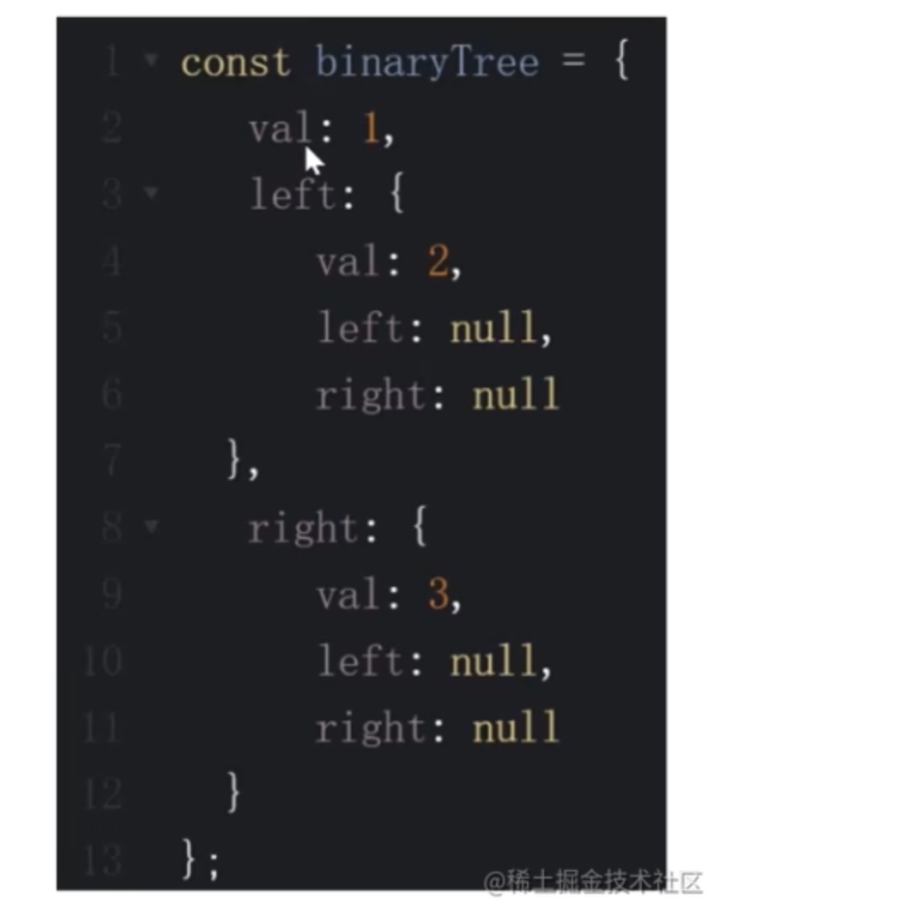
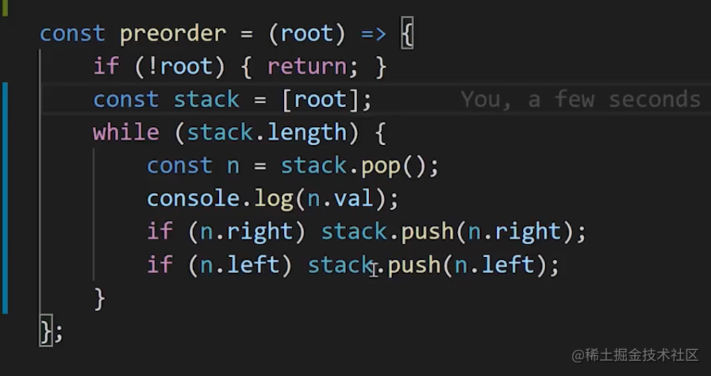
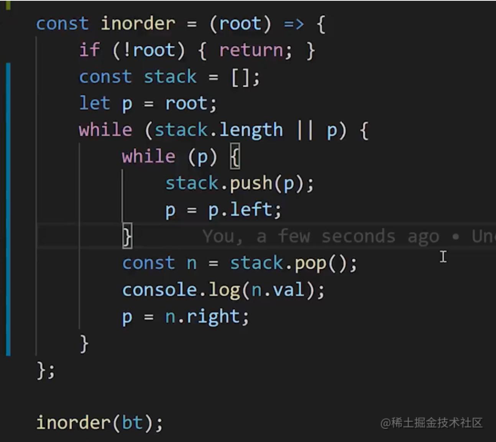
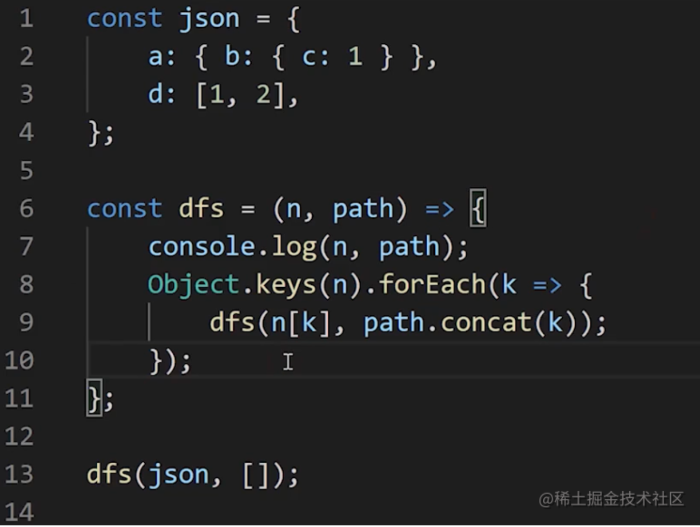
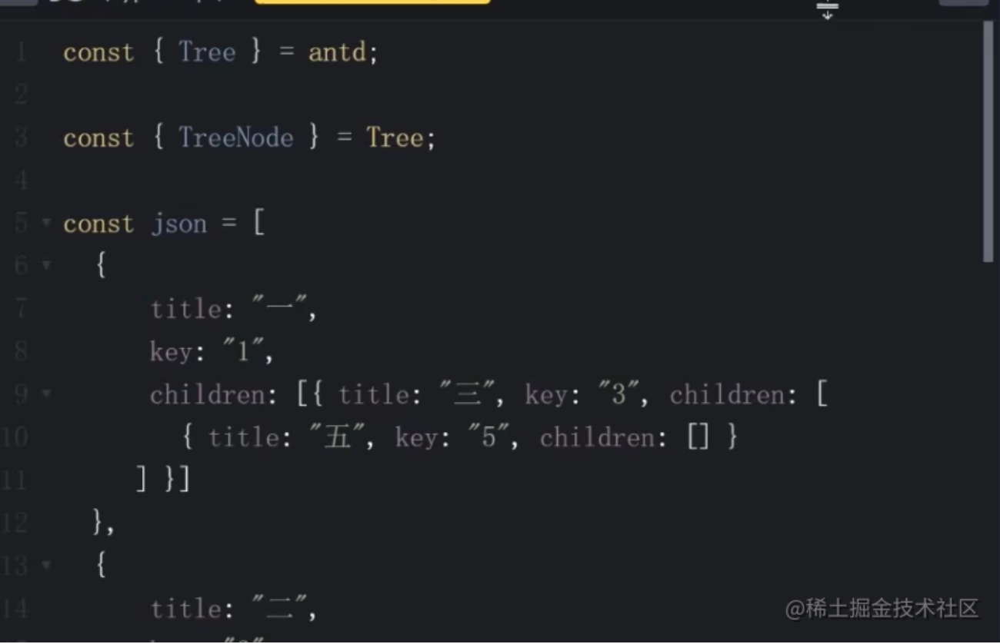
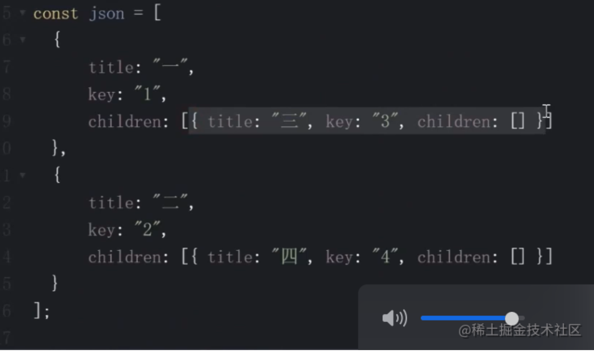
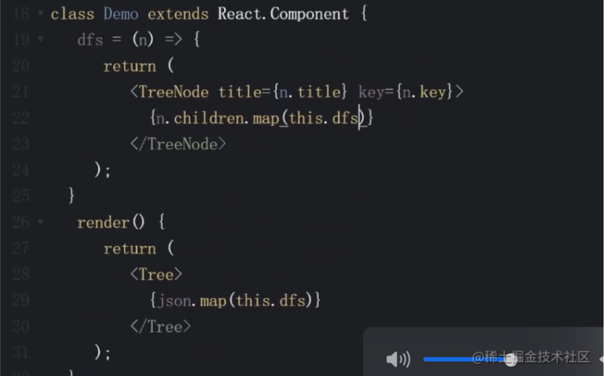

# （八）数据结构之“树”

# 树是什么？

一种`分层数据`的抽象模型。

前端工作中常见的树包括：`DOM树`、`级联选择`、`树形控件`...

JS 中，可以使用 `Object/Array` 来构建树。

    const tree = {
        val: 'a',
        children: [
            {
                val: 'b',
                children: [
                    {
                        val: 'd',
                        children: []
                    },
                    {
                        val: 'e',
                        children: []
                    }
                ]
            },
            {
                val: 'c',
                children: [
                    {
                        val: 'f',
                        children: []
                    },
                    {
                        val: 'g',
                        children: []
                    }
                ]
            }
        ]
    }

- 树的常用操作

深度/广度优先遍历、先中后序遍历（二叉树）。

# 树的深度与广度优先遍历

## 深度优先遍历

尽可能`深`的搜索树的分支。

- 算法

1.  访问根节点
2.  对根节点的 children 挨个进行深度优先比遍历

    // 深度优先遍历
    function dfs(root) {
    console.log(root)
    root.children.forEach(ele => dfs(ele))
    }

## 广度优先遍历

先访问离根节点`最近`的节点。

- 算法

1.  新建一个队列，把根节点入队
2.  把对头出队并访问
3.  把对头的 children 挨个入队
4.  重复第二、三步，知道队列为空

    // 广度度优先遍历
    function bfs(root) {
    const queue = [root]

        while(queue.length > 0) {
            const n = queue.shift()
            console.log(n)
            n.children.forEach(ele => queue.push(ele))
        }

    }

# 二叉树的先中后序遍历

## 二叉树是什么

树中每个节点最多只能有`两个子节点`。

在 JS 中通常用 Object 来模拟二叉树。

    const binaryTree = {
        val: 1,
        left: {
            val: 2,
            left: {
                val: 4,
                left: null,
                right: null
            },
            right: {
                val: 5,
                left: null,
                right: null
            }
        },
        right: {
            val: 3,
            left: {
                val: 6,
                left: null,
                right: null
            },
            right: {
                val: 7,
                left: null,
                right: null
            }
        }
    }

## 先序遍历

1. 访问`根`节点
2. 对根节点的`左`子树进行先序遍历
3. 对根节点的`右`子树进行先序遍历

   // 二叉树的先序遍历
   function preOrder(root) {
   if (!root) {
   return
   }
   console.log(root.val)
   preOrder(root.left)
   preOrder(root.right)
   }

## 中序遍历

1. 对根节点的`左`子树进行中序遍历
2. 访问`根`节点
3. 对根节点的`右`子树进行中序遍历

   // 二叉树的中序遍历
   function inOrder(root) {
   if (!root) {
   return
   }
   inOrder(root.left)
   console.log(root.val)
   inOrder(root.right)
   }

## 后序遍历

1. 对根节点的`左`子树进行后序遍历
2. 对根节点的`右`子树进行后序遍历
3. 访问`根`节点

   // 二叉树的后序遍历
   function postOrder(root) {
   if (!root) {
   return
   }
   postOrder(root.left)
   postOrder(root.right)
   console.log(root.val)
   }

# 二叉树的先中后序遍历（非递归版）

用`栈`模拟递归的过程。

## 先序遍历

## 中序遍历

## 后序遍历

# LeetCode：104. 二叉树的最大深度

[104. 二叉树的最大深度 - 力扣（LeetCode） (leetcode-cn.com)](https://leetcode-cn.com/problems/maximum-depth-of-binary-tree/)

## 解题思路

求最大深度，考虑使用深度优先遍历。

在深度优先遍历过程中，`记录`每个节点所在的`层级`，找出最大的层级即可。

1.  新建一个变量，记录最大深度
2.  深度优先遍历整棵树，并记录每个节点的层级，同时不断刷新最大深度这个变量。
3.  遍历结束返回最大深度这个变量

    /\*\*

    - Definition for a binary tree node.
    - function TreeNode(val, left, right) {
    -     this.val = (val===undefined ? 0 : val)
    -     this.left = (left===undefined ? null : left)
    -     this.right = (right===undefined ? null : right)
    - }
      \*/
      /\*\*
    - @param {TreeNode} root
    - @return {number}
      \*/
      var maxDepth = function(root) {
      let dep = 0
      const dfs = (n, l) => {
      if(!n) {
      return
      }
      if (n.left === null && n.right === null) {
      dep = Math.max(dep, l)
      }
      dfs(n.left, l + 1)
      dfs(n.right, l + 1)
      }
      dfs(root, 1)
      return dep
      };

## 复杂度

- 时间复杂度：`O(N)`
- 空间复杂度：`O(logN) - O(N)`

# LeetCode：111. 二叉树的最小深度

[111. 二叉树的最小深度 - 力扣（LeetCode） (leetcode-cn.com)](https://leetcode-cn.com/problems/minimum-depth-of-binary-tree/)

## 解题思路

求最小深度，考虑使用广度优先遍历。

在广度优先遍历过程中，遇到叶子节点，停止遍历，返回节点层级。

1.  广度优先遍历整棵树，并记录每个节点的层级
2.  遇到叶子节点，返回节点层级，停止遍历

    /\*\*

    - Definition for a binary tree node.
    - function TreeNode(val, left, right) {
    -     this.val = (val===undefined ? 0 : val)
    -     this.left = (left===undefined ? null : left)
    -     this.right = (right===undefined ? null : right)
    - }
      \*/
      /\*\*
    - @param {TreeNode} root
    - @return {number}
      \*/
      var minDepth = function(root) {
      if (!root) {
      return 0;
      }
      let l = 1
      const q = [[root, l]]
      while(q.length) {
      let [n, l] = q.shift()
      if (!n.left && !n.right) {
      return l
      }
      if (n.left) q.push([n.left, l + 1])
      if (n.right) q.push([n.right, l + 1])
      }
      };

## 复杂度

- 时间复杂度：O(N) (N：树的节点数量）
- 空间复杂度：O(N) (N：树的节点数量）

# LeetCode：102. 二叉树的层序遍历

[102. 二叉树的层序遍历 - 力扣（LeetCode） (leetcode-cn.com)](https://leetcode-cn.com/problems/binary-tree-level-order-traversal/)

## 解题思路

层序遍历顺序就是广度优先遍历。

不过在遍历的时候需要记录当前节点所处的层级，方便将其添加到不同的数组中。

1.  广度优先遍历二叉树
2.  遍历过程中，记录每个节点的层级，并将其添加到不同的数组中。

    /\*\*

    - Definition for a binary tree node.
    - function TreeNode(val, left, right) {
    -     this.val = (val===undefined ? 0 : val)
    -     this.left = (left===undefined ? null : left)
    -     this.right = (right===undefined ? null : right)
    - }
      \*/
      /\*\*
    - @param {TreeNode} root
    - @return {number[][]}
      \*/
      var levelOrder = function(root) {
      if (!root) return []
      const queue = [[root, 0]]
      const result = []
      while(queue.length) {
      const [n, l] = queue.shift()
      if (!result[l]) {
      result[l] = [n.val]
      } else {
      result[l].push(n.val)
      }
      if (n.left) queue.push([n.left, l + 1])
      if (n.right) queue.push([n.right, l + 1])
      }
      return result
      };

## 复杂度

- 时间复杂度：O(N)
- 空间复杂度：O(N)

# LeetCode：94. 二叉树的中序遍历

# LeetCode：112. 路径总和

[112. 路径总和 - 力扣（LeetCode） (leetcode-cn.com)](https://leetcode-cn.com/problems/path-sum/)

## 解题思路

在`深度优先遍历`的过程中，记录`当前路径`的节点值的和。

在`叶子节点`处，判断当前路径的节点值的和是否等于目标值。

1.  深度优先遍历二叉树，在叶子节点处，判断当前路径的节点值的和是否等于目标值，是就返回 `true`
2.  遍历结束，如果没有匹配到，就返回 `false`

    /\*\*

    - Definition for a binary tree node.
    - function TreeNode(val, left, right) {
    -     this.val = (val===undefined ? 0 : val)
    -     this.left = (left===undefined ? null : left)
    -     this.right = (right===undefined ? null : right)
    - }
      \*/
      /\*\*
    - @param {TreeNode} root
    - @param {number} targetSum
    - @return {boolean}
      \*/
      var hasPathSum = function(root, targetSum) {
      if(!root) {return false}
      let flag = false
      const dfs = (n, sum) => {
      if (!n.left && !n.right) {
      if (targetSum === sum) {
      flag = true
      }
      }
      if (n.left) dfs(n.left, n.left.val + sum)
      if (n.right) dfs(n.right, n.right.val + sum)
      }
      dfs(root, root.val)
      return flag
      };

## 复杂度

- 时间复杂度：O(N) （N 树的节点树）
- 空间复杂度：O(N) （N 树的深度，递归堆栈的高度）

# 前端与树：遍历 JSON 的所有节点值

深度优先遍历。

# 前端与树：渲染 Antd 中的树组件---

深度优先遍历。

根据 JSON 结构，渲染出树的结构。

