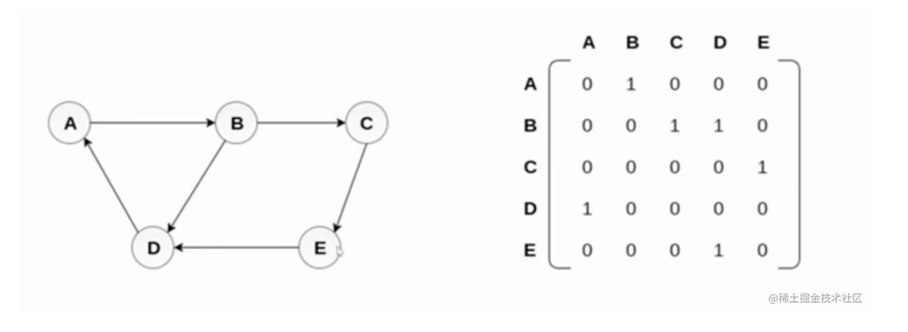
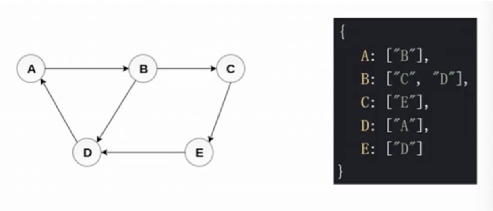
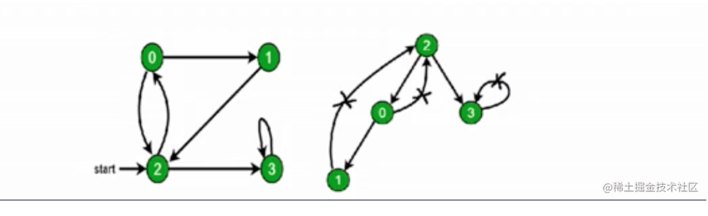

# （九）数据结构之“图”

# 图简介

图是`网络结构`的抽象模型，是一组由`边`连接的`节点`。

图可以表示任何`二元关系`（一条边只能两个节点相连），比如：道路、航班...

# 图是什么

JS 中没有图，可以是用 Object 和 Array 构件图。

图的表示法：`邻接矩阵`、`邻接表`、关联矩阵...

## 邻接矩阵

二维数组（矩阵）来表示。

## 邻接表

构建一个对象，key 为各个节点，key 的值，为连接的各个节点。

# 图的常用操作

## 深度优先遍历

尽可能深的搜索图的分支。

1. 访问根节点
2. 对根节点的`没访问过的相邻节点`挨个进行深度优先遍历

    const graph = {
        0: [1, 2],
        1: [2],
        2: [0, 3],
        3: [3]
    }

    const visited = new Set()
    function dfs(n) {
        console.log(n)
        visited.add(n)
        graph[n].forEach(c => {
            if (!visited.has(c)) {
                dfs(c)
            }
        })
    }

    dfs(2) // 2 0 1 3

## 广度优先遍历

先访问离根节点最近的节点。

1.  新建一个队列，把根节点入队
2.  把对头出队并访问
3.  把对头的`没访问过的相邻节点`入队
4.  重复第二、三步，知道队列为空

    const graph = {
    0: [1, 2],
    1: [2],
    2: [0, 3],
    3: [3]
    }

    const visited = new Set()
    function bfs (n) {
    visited.add(n)
    const queue = [n]

        while(queue.length) {
            const c = queue.shift()
            console.log(c)
            graph[c].forEach(ele => {
                if (!visited.has(ele)) {
                    queue.push(ele)
                    visited.add(ele)
                }
            })
        }

    }

    bfs(2)

# LeetCode：65. 有效数字

[65. 有效数字 - 力扣（LeetCode） (leetcode-cn.com)](https://leetcode-cn.com/problems/valid-number/)

# 417. 太平洋大西洋水流问题

[Loading Question... - 力扣（LeetCode） (leetcode-cn.com)](https://leetcode-cn.com/problems/pacific-atlantic-water-flow/)

# LeetCode：133. 克隆图

[Loading Question... - 力扣（LeetCode） (leetcode-cn.com)](https://leetcode-cn.com/problems/clone-graph/)
