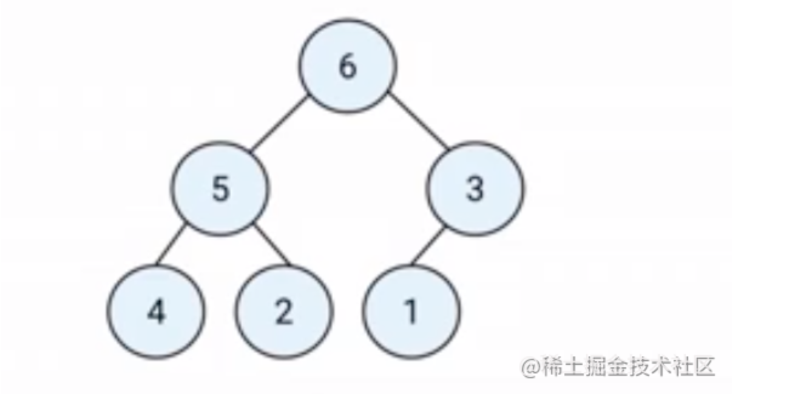
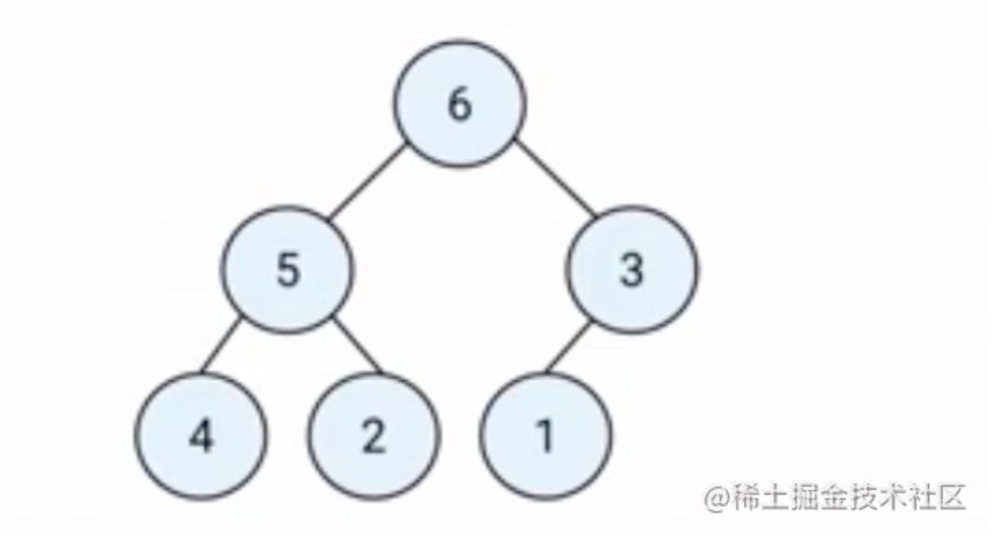
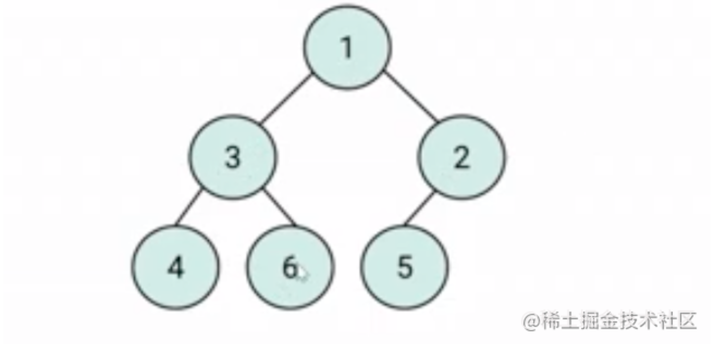
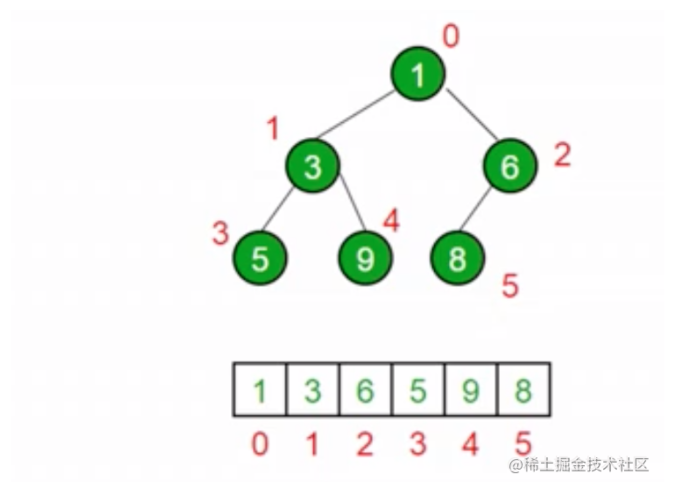
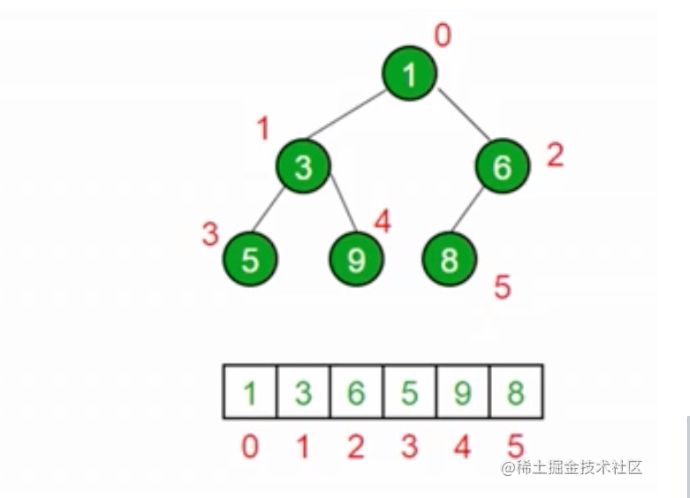

# （十）数据结构之“堆”

# 堆是什么？

堆是一种特殊的`完全二叉树`。

每层填满，最后一层如果没有填满，只缺少右边的若干节点。

所有的节点都大于等于（`最大堆`）。

所有的节点小于等于（`最小堆`）他的子节点。

## JS 中的堆

JS 中通常用数组表示堆。

广度优先遍历 的下标作为数组的下标。

左侧子节点的位置是 `2 * index + 1`。

右侧子节点的位置是 `2 * index + 2`。

父节点位置是 `(index - 1) / 2`。

## 堆的应用

堆能高效、快速地找出最大值和最小值。

时间复杂度：`O(1）` 。

找出第 K 个最大（最小）元素 这一类问题。

### 第 K 个最大元素

1. 构建一个`最小堆`，并将元素依次插入堆中
2. 当堆的容量超过 K，就删除堆顶
3. 插入结束后，堆顶就是第 K 个最大元素

# JavaScript 实现一个最小堆类

## 实现步骤

1.  在类里，声明一个数组，用来装元素
2.  主要方法：插入、删除堆顶、获取堆顶、获取堆大小
