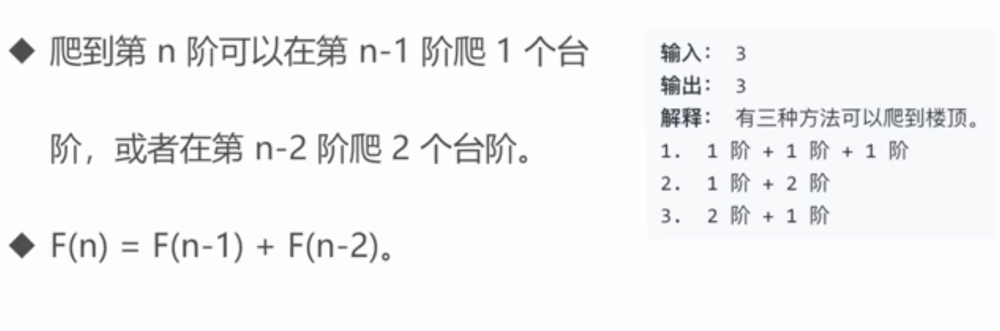
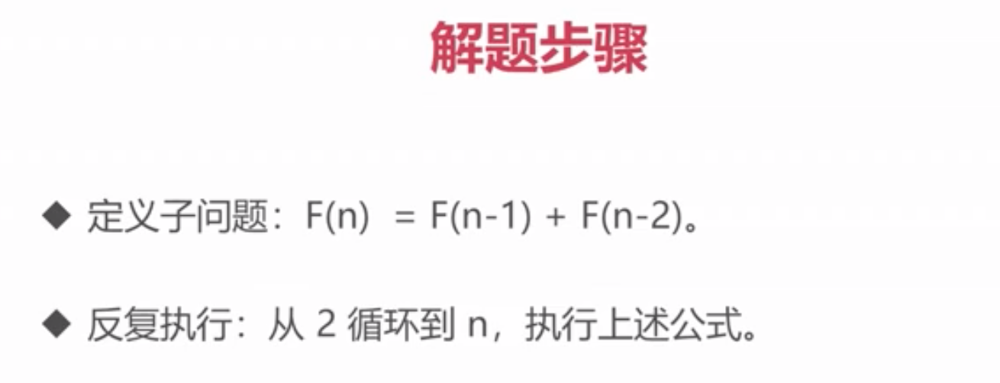
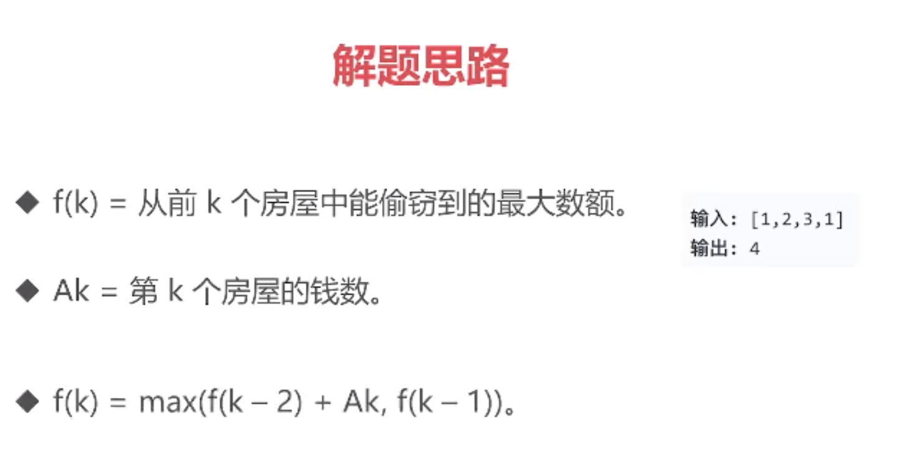
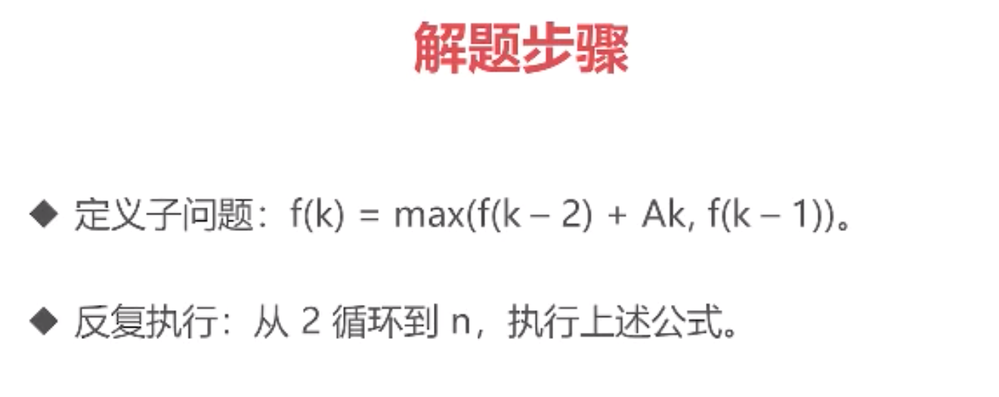

# 十三、 动态规划

# 动态规划

它将一个问题分解为**相互重叠**的子问题，通过反复求解子问题，来解决原来的问题。

# 2

[https://leetcode.cn/problems/climbing-stairs/](https://leetcode.cn/problems/climbing-stairs/)

[https://leetcode.cn/problems/house-robber/](https://leetcode.cn/problems/house-robber/)

